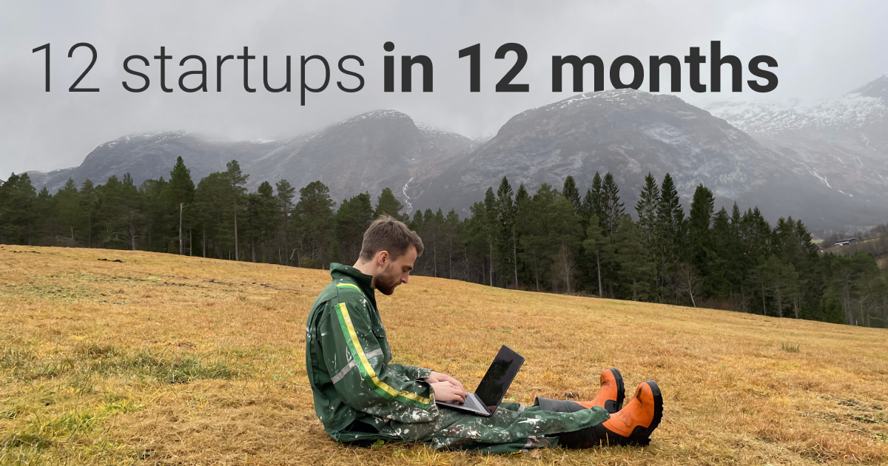
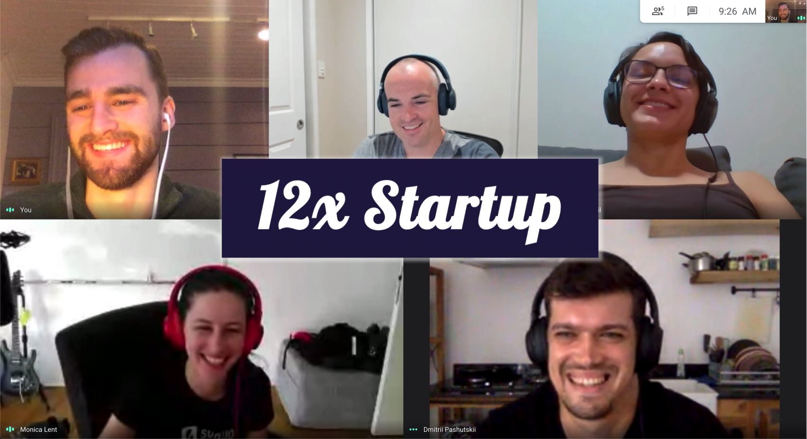

I recommend you read this article with this song in the background:

<iframe width="100%" height="140" scrolling="no" frameborder="no" allow="autoplay" src="https://w.soundcloud.com/player/?url=https%3A//api.soundcloud.com/tracks/101334363&color=%23ff5500&auto_play=false&hide_related=false&show_comments=true&show_user=true&show_reposts=false&show_teaser=true&visual=true"></iframe>

The time has come.

After years of creating stuff into the void. After years of building things and never launching them. After years of working on other people's dreams.

I step into the ranks of the giants, and do the **12 startups in 12 months** challenge.

## Startup is the new corporate

Modern startup culture fronts ideas like **toxic work hours**, **burning bridges** and **lock-in effects**. The burnout rate in startups and the modern tech world is devastating.

I don't want to be a part of this.

I will go my own way.

## The world is getting faster

10 years ago you would need a team of 5 and months to build something.

5 years ago you could do it alone.

Now, you can do it in an afternoon -- and you **might not even need to code**.

> If you are slow you are going to be left out.

## Improve my habits

I am a builder at heart, but like many [creatives](https://customercontactadvisor.blr.com/marketing/4-reasons-creative-people-struggle-to-finish-projects/), I have troubles **finishing** my projects. Showing off your baby is a real uncomfortable thing. Many founders get stuck in this paralysis.

By taking on this project I will constantly put myself in situations where I *need* to finish. This is the best practice I could dream of for improving this habit.

## Together we are stronger

I am doing this project together with 5 other motivated makers at [12xstartup.com](https://12xstartup.com/). We are all doing our own 12 startups, but as a group we push each other, and help each other on the way.

Subscribe to the 12xstartup [newsletter](https://12xstartup.com/) to get access to monthly livestreamed launch events.

* [Monica Lent](https://monicalent.com/12x-startup/) (Berlin, Germany)
* [Toheeb Ogunbiyi](https://twitter.com/ToheebDotCom/status/1311747021305503746) (Abuja, Nigeria)
* [Dmitrii Pashutskii](https://dpashutskii.com/a-year-of-making) (Bali, Indonesia)
* [Stefanni Brasil](https://www.hexdevs.com/12xstartup/) (Vancouver, Canada)
* [Dylan Wilson](https://www.dylanwilson.net/12x-startup-four-makers-building-open-startups-for-a-year/) (Brisbane, Australia)

## 12 Startups in 12 Months

I will keep updating my progress here.

**What do I want to build?**

* SaaS products on the web
* At least one B2B product
* At least one fintech bank API product
* Require little maintenence work
* Facilitate long term passive income
* Some of them focused on my key areas: **music**, **time**, **psychology**.

### #1 [Slapper.io](https://slapper.io/) - music snippets organizing tool

My first project (november) is called Slapper, and is aimed at people working with music.

**Problem:**

* No way to annotate songs in playlists
* No way to choose a specific segment of a song and store it or share it
* Different streaming services can't be in the same list

**Solution:** Slapper is a tool to organize songs and segments of songs from *any* streaming platform. Let's you create shareable interactive documents of music.

**Launch stats:**

Read [Launching Slapper (Startup #1)](/startup-1-slapper).

⏳ Time spent: 1.5 months

📝 Signups: 200

🎖 Premium users: 1

💰 Revenue: $5 MRR

### #2 [FileParty.co](https://fileparty.co/) - p2p real time file sharing

Read post here: [Launching FileParty (Startup #2)](/fileparty-launch).

**Launch stats:**

⏳ Time spent: 3 weeks

⬆️ Upvotes on ProductHunt: 192

👀 Visitors: 635

🔗 Boards created: 1073

💰 Revenue (donations): 0$

## Makers who are inspiring me

- [Alex West](https://www.alexwest.co/)
- [Pieter Levels](https://levels.io/)

## Follow me on the journey

I will be posting progress updates on [twitter](https://twitter.com/larskarbo). Be sure to follow me there!