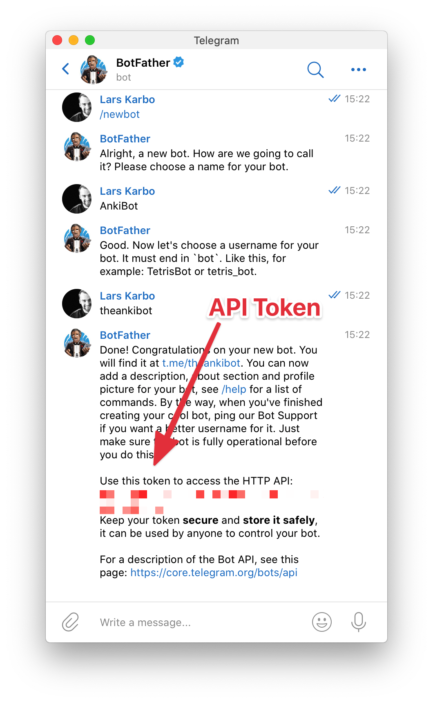
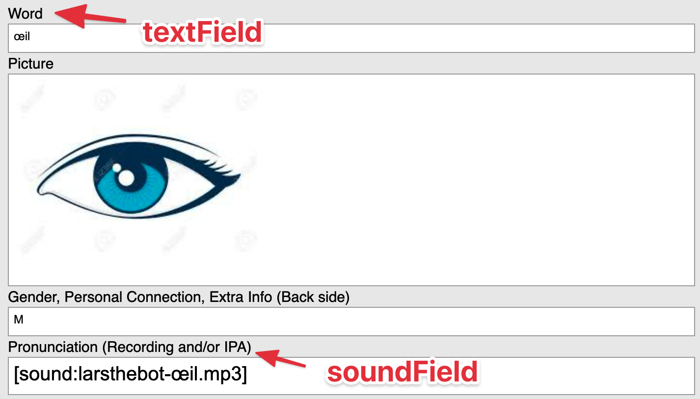

If you have ever used Anki for language learning, you know how important **native voice recordings** are.

Native voice recordings lets you learn the sounds and how they correlate to the written language.

**Ankibot** is a Telegram bot to let anyone remotely record pronounciations for your Anki collection.


# Features:

- **Ease-of-use.** The Telegram makes it is easy to record sounds on any platform.
- **Perfect for outsourcing.** No need to split mp3s and work with audio manually. Just point your coach to the bot!
- **Flexible api.** Define which notes you want to have recorded in `noteSpec.js`. Specify field, deck and card type.
- **MP3s.** Converts all sound files to mp3 so cards run on any platform.
- **Multi-note smartness.** If you have the same word/sentence to be recorder on multiple notes, it will automatically add the sound to all notes.
- **Performance.** Asynchronous network actions means you will never be waiting for the database.
- **Secure.** Periodically checks if sounds are being recorded properly and saved to the Anki DB.
- **Retry possibility.** Listen to your recording and do another recording right away if you are not satisfied.
- **Any language or learning material.** Ankibot is not tied up to a specific language or subject! Use it for whatever you need sounds for.
- **Access control.** To prevent abuse, you can specify which chat-ids you want to have access.
- **Emojis.** 🎤🌈

# Set up your own AnkiBot:

You can also check out the repo here: [https://github.com/larskarbo/ankibot](https://github.com/larskarbo/ankibot)

## Create Telegram bot.

Create a new Telegram bot and retrieve the API Token. Use the **@botfather** bot.



Add the environment variable `ANKIBOT_API_TOKEN`=YOUR_API_TOKEN to your `.zshenv` or wherever you like to have that stuff.

## Add AnkiConnect to your Anki instance

In order to communicate with your Anki instance, AnkiBot uses `[AnkiConnect](https://foosoft.net/projects/anki-connect/)`.

Follow the [installation instructions](https://foosoft.net/projects/anki-connect/) for adding AnkiConnect.

### Install dependencies & clone repo

To run AnkiBot, you will need [Node.js](https://nodejs.org/en/), [yarn](https://yarnpkg.com/) and [ffmpeg](http://www.ffmpeg.org/).

Follow the corresponding tutorials to install those, if you don't have them already.

Clone the repository:

```bash
git clone https://github.com/larskarbo/ankibot.git
cd ankibot
```

Install npm dependencies:

```bash
yarn install
```

## Configure note specifications

In order for **AnkiBot** to know which cards you want to record sounds for, and which fields to fill in, you will need to populate the `noteSpecs.config.js` file.

I use card templates from the [Fluent Forever Book](https://fluent-forever.com/book/) and my `noteSpecs.config.js` file looks like this:

```jsx
module.exports = [
  {
    deck: '*',
    cardType: '3. All-Purpose Card',
    textField: '- The full sentence (no words blanked out)',
    soundField: '- Extra Info (Pronunciation, personal connections, conjugations, etc)',
  },
  {
    deck: '*',
    cardType: '2. Picture Words',
    textField: 'Word',
    soundField: 'Pronunciation (Recording and/or IPA)',
  },
]
```

The field properties refer to which field that contains text and the sound file. `deck` is set to wildcard (`*`) and `cardType` refers to the card type I am using (the normal is `basic`).



## Run it!

Make sure Anki is open, then run the script:

```bash
yarn start
```

Now go to your bot in Telegram and start recording by writing /start.

---

I would love to hear if you have any issues or unexpected problems.

Let me know in the comments!