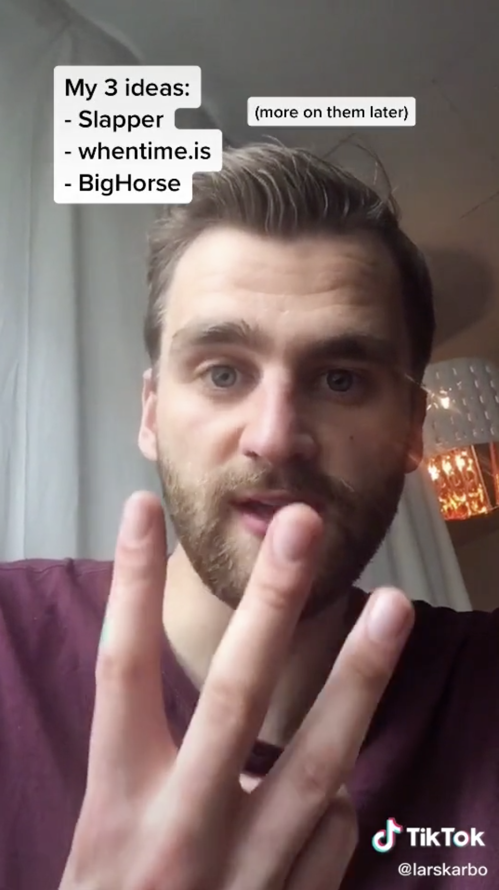

Is it scary? Yes.

Is it uncomfortable? Yes.

I just posted my first TikTok in what might be a little **life-changing experiment**.

*Why I did it?* It is not random. It is a well planned thing, with some exciting predictable outcomes.

>\>> [See the video HERE](https://www.tiktok.com/@larskarbo/video/6876408841496562945?lang=en) <<

I am going to post a new video like this **every day** for *at least a month*.

The quality is a bit low, and it wasn't as polished as I wanted, but that doesn't matter. The system is the key, and starting imperfectly is way better than never starting.

## Why did I do this?

Here are the 4 reasons I'm doing this:

### 1. Tear down my own mental prison walls.

Most of the things we are afraid of are just inside our heads. Fear of embarrassment have stopped people from doing what they love for ages.

Fantastic things can happen when you realize how fear of embarrassment can limit you, and you start working to remove it. The biggest barrier to success is yourself.

By taking this step in an uncomfortable space, I start the process of learning that *it doesn't matter*. I'm not going to die. People will probably not care much. If it is bad, people will forget about it quickly.

### 2. Getting to know people

<!-- TODO, clarify. Attract people? Know people? Meet people? -->

If you are invisible in this modern age, **you don't exist**.

By putting your face and ideas out there, people will start to reach out. They will have you in their subconscious, and over time it will compound to more quality connections.

### 3. Accountability and audience

The core goal of this experiment isn't TikTok in itself, it is Indie Hacking and building products.

By putting your work out there and [building in public](https://growthhacklist.com/methods/build-in-public), you will get some different advantages:

- **Accountability**. People will expect you to make progress and you will strive to deliver.
- **Less lonely**. It can feel lonely to work on own projects for a long time. Show it to others and you'll feel better.
- **Feedback and early customers**. This is important when building stuff.

### 4. Creative expression

TikTok is a platform that supercharges creative expression. It is really fun.

The way we communicate will shift towards the trends we have seen with Snapchat, Instagram and now TikTok. Short, entertaining videos might be the core way to communicate in the future. Teens and young people are the first adopters, but it will soon ripple through to the rest of society too.

TikTok might fail, but the format will persist.

## What is Indie Hacking. The plan and my 3 ideas:

Indie hacking - or **independent hacking** - is the philosophy of building, shipping and selling products on your own. Popularized by people like [@pieterlevels](https://levels.io/) and made possible by innovations in the tech and dev space.

My ideas as you see in the TikTok:

- **Slapper** is the idea I'm going to realize first. It is a platform where you can refer to songs from Youtube or Spotify and take notes on them. You can also refer to specific segments of the songs. **More on this soon on TikTok!**
- **whentime.is** is a url timezone utility I *think* can be useful, but I'm not sure. Imagine typing whentime.is/4pm-in-oslo to send a link to anyone in the world and they'll get their local time at that time. Genius? Yes?

## Follow me on this journey

If you are interested in following how this TikTok experiment goes, download the app and follow me: [tiktok.com/@larskarbo](https://www.tiktok.com/@larskarbo/).

Feedback or thoughts about this whole thing are greatly appreciated. Send them wherever or on DM on [twitter](https://twitter.com/larskarbo).