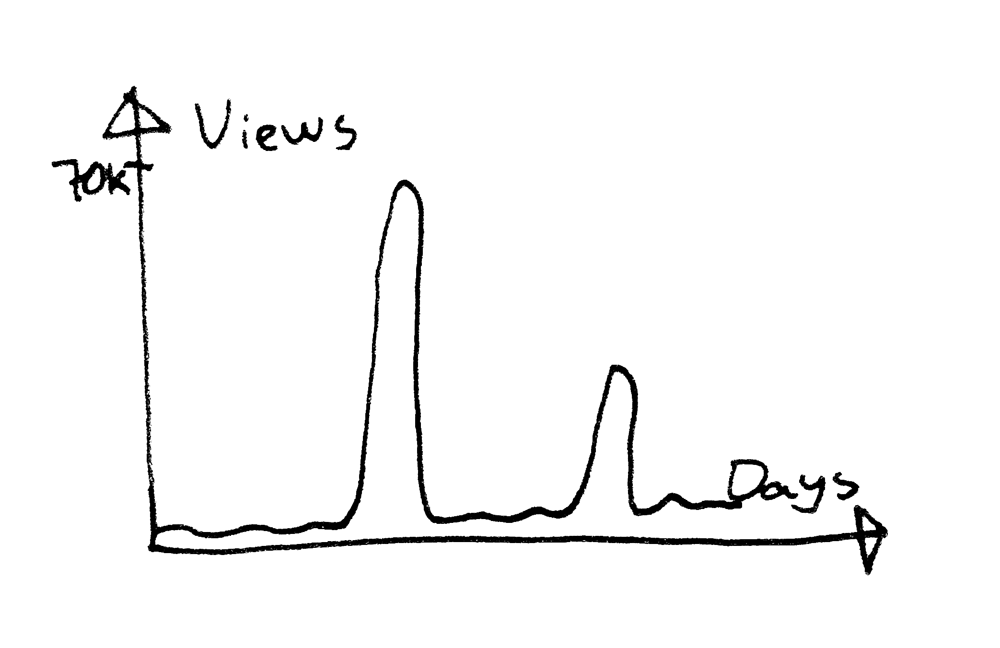
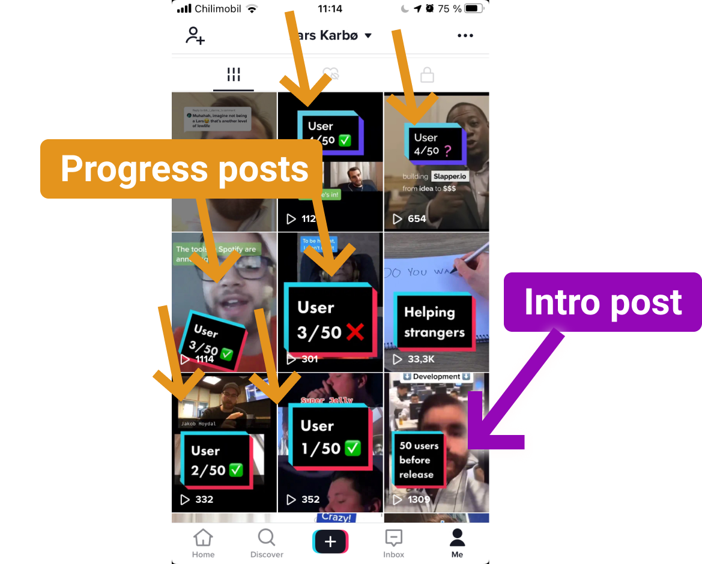

I recently started my TikTok project, where I post everyday about my indie hacking journey.

> Now, 21 days after, I have over 100.000 views and 22.50\$ revenue.

Would the TikTok audience like hearing about techy topics?

I set out to try.

I have never been very active on social media, and never exposed myself on video this way. This was truly an uncomfortable thing for me to do, especially in the beginning.

## My posts 📝

My system was to post every day. No matter if it was going to be a low quality one, I was going to post it.

That seemed to be a genius system, because some of the best-performing videos I made were the videos I _didn't want to post_.

### The intro post (600 views)

I started out with a video explaining my story.

1. I quit my job.
2. I was going to work on some projects.

`youtube: https://youtu.be/NCX9atdT4bo`

After this, the show was on. It was a huge leap out of my comfort zone.

### The brain computer (1400 views)

The first video that I felt worked really well, was the one where I talk about the 🧠 brain computer.

https://twitter.com/larskarbo/status/1311292768191483905

In the end of the video I tell my followers that I am going to **make music** with my brain.

I never figureed out how to do that, haha. Will need to look into that some time.

### LarsList.org (70.000 views)

This one was crazy.

I made [LarsList.org](http://larslist.org/). A site that lists people named Lars.

The website got thousands of views and almost 200 Lars submissions.

`video: https://www.youtube.com/watch?v=sKpY_QYM7kY`

The story behind this is that a lot of the people I interacted with daily was named "Lars". I made this video as a joke, but it turned out to become pretty big.

> I think the reason this idea took off is that there actually are _a lot_ of people named Lars in Norway, where I live!

The process of adding Larses was not automated so it was A LOT of work for me.

Because of that, I decided to add a paywall to restrict submissions. More on that in the end of this article.

### The Slapper.io journey (3000 views - multiple videos)

Until this point, I mostly made random videos about programming, building on the web and things like that.

But I felt I wanted to actually share some real work, and have some more consistency.

Build a story. Build a project.

So that's why I released my **50 customers before release** project.

`video: https://youtu.be/ohhZsZ7HnYk`

The idea was simple: "Interview one new person every day about my Slapper idea. Try to get them onboard and pay 5\$ to be a beta-tester. Get 50 people to say yes".

Find all videos on [my TikTok](https://www.tiktok.com/@larskarbo).

This is a great thing to do both for business and social media. In business it is smart to talk to potential customers before building. In social media it is smart to have a system or a story to tell.

## How did I get 💰 revenue from all of this?

You don't earn money directly from TikTok.

But you can earn money if you refer people _from_ TikTok to your products.

In my case I earned 22.50\$:

- 2.50$ x 3 = **7.50$** - LarsList.org submissions. After a lot of manual work of adding Larses I added a paywall to restrict submissions. A few people paid to get added. That's fun.
- 5.00$ x 3 = **15.00\$** - For my Slapper.io journey, I ask people to pay 5$ to be a beta tester. 3 people have paid.

I think the audience and experience you earn on TikTok is way more valuable than the few short-time dollars you can squeeze out. But it is fun to earn a bit.

## Conclusion

> I got over 100.000 views from posting about indie hacking 21 days on TikTok.

I learnt a lot about 🤛 **pushing comfort zones**, 📹 **video editing** and 📢 **interacting with an audience**.

The money I earned was *mostly symbolic*, but is possible to leverage better with a better strategy and products.

----

Follow me on [TikTok](https://www.tiktok.com/@larskarbo) or [Twitter](https://twitter.com/larskarbo) 😌

What do you think about this way of communicating? _Let me know in the comments._
