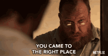
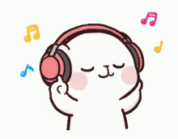
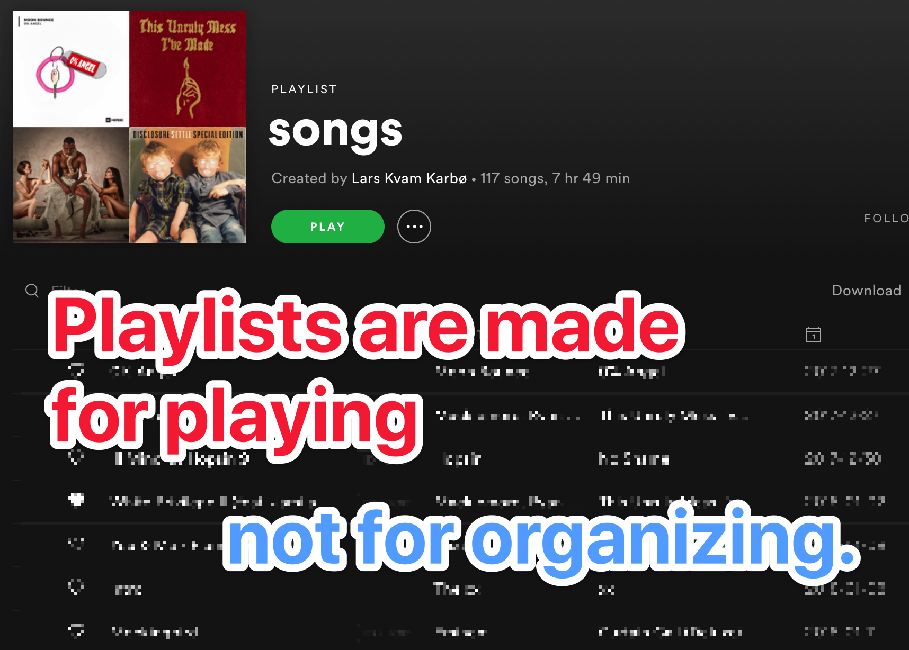
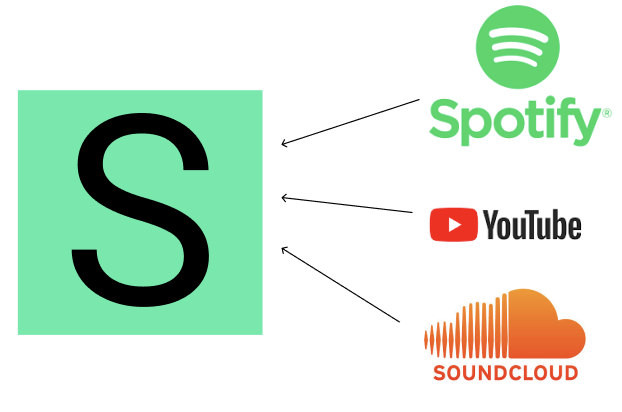
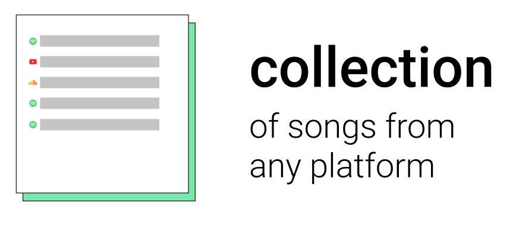
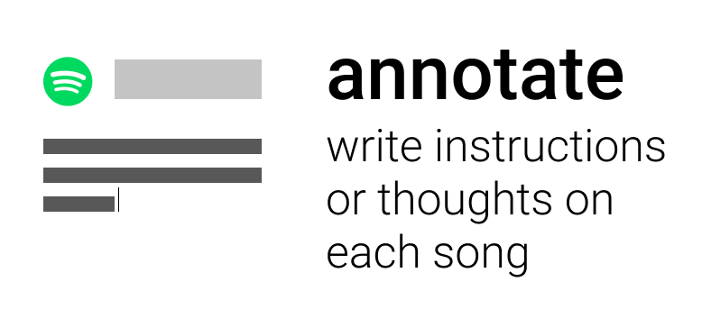
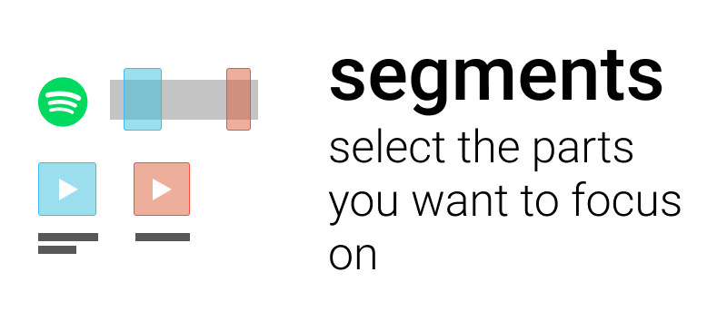

Are you a **music teacher**?

Or maybe you work with music in another way?

I am building a tool that will make your life a whole lot easier.

## Listening is a valuable skill

It is important to **listen** to music in order to be good.

Developing a good ear is key to become a good musician. Your students should **listen** to music a lot.

We live in a world with fantastic opportunities for listening to music. Millions of songs are available on **Spotify**, **Youtube** and **SoundCloud**.

But how do you systematically work with these services?

## Playlists suck

Playlists are a weird way of organizing songs.

Not made for organizing, made for **playing**.

You need a tool made for organizing.

If you want to **refer your student** to songs right now, you have different options:

* Use a playlist (I already told you they are bad)
* Send links
* Tell the student to search it up
* Send an **mp3**

None of these ways are ideal.

Let me show you the best way to do it.

## Use Slapper to organize and collaborate

[Slapper](https://slapper.io) is a tool that let's you connect to **Youtube, Spotify and Soundcloud**.

You then make an **interactive document** where you can add songs.

You can **annotate** on the songs. Maybe you want the student to do something special, or remember certain elements.

You can reference specific segments and play them directly.

Slapper is in **beta**, and I want *you* to test it.

Be one of the first.

Let me know if you are interested. Send me a DM on [twitter.com/larskarbo](https://twitter.com/larskarbo)