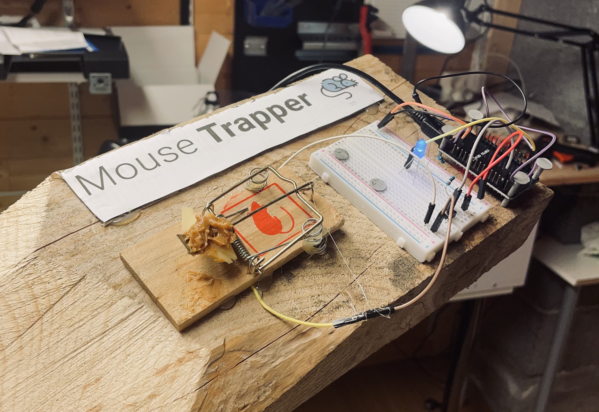
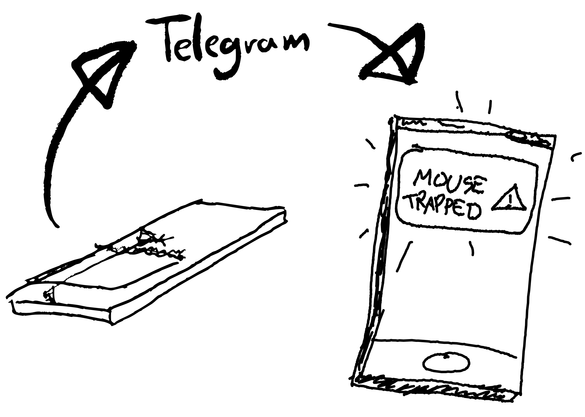
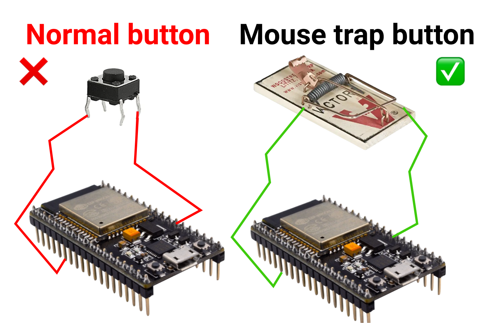
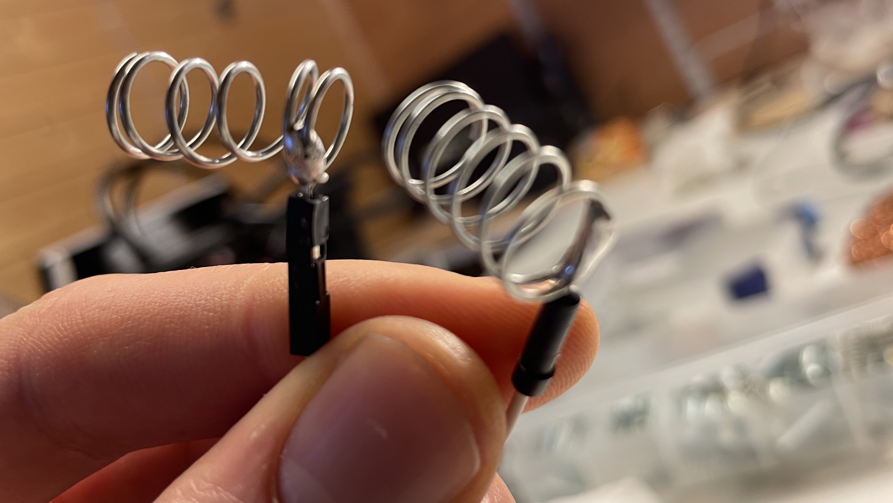
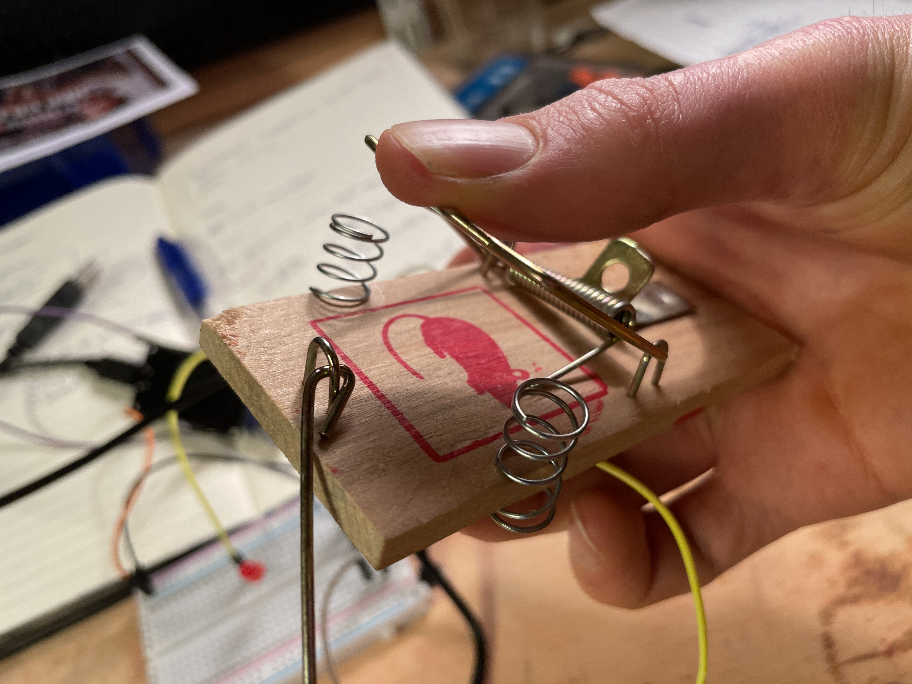
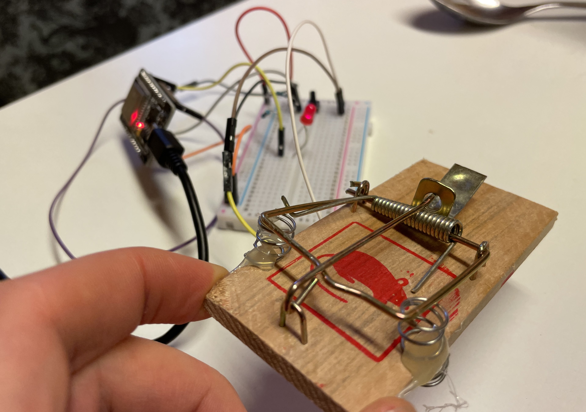
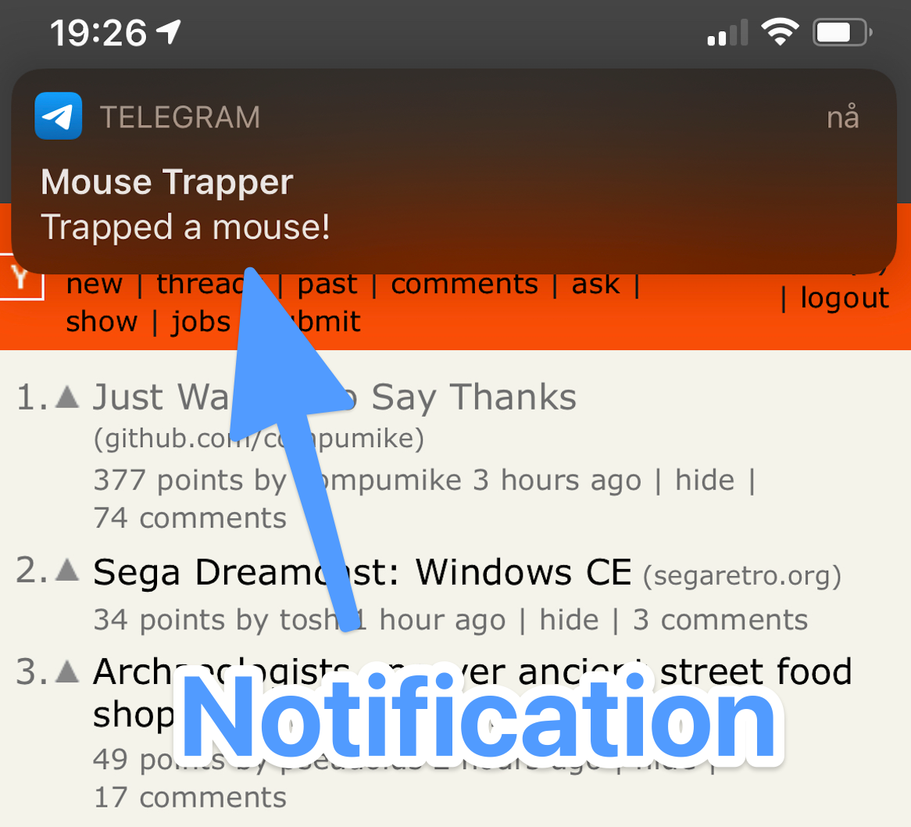
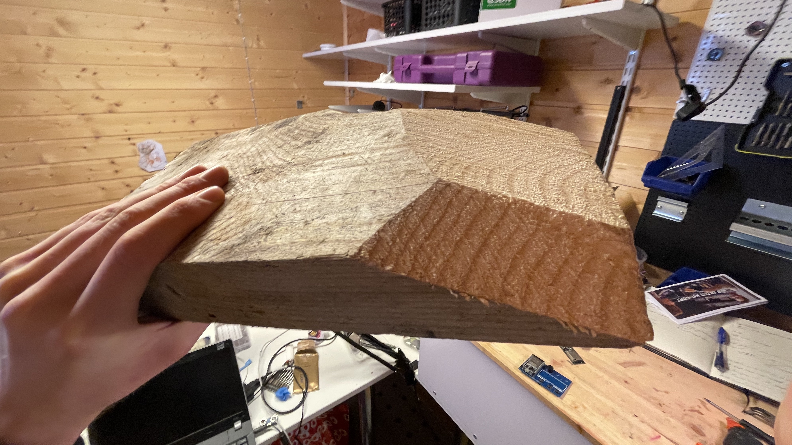
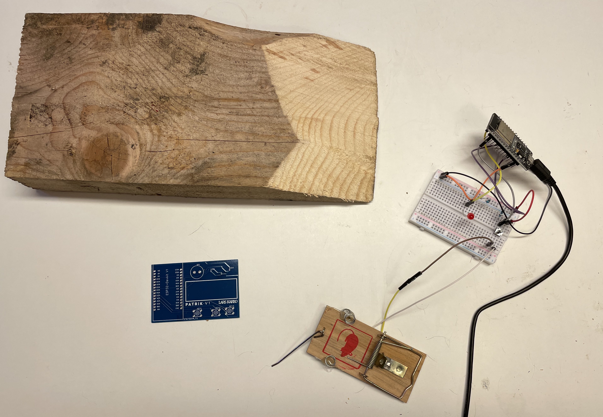
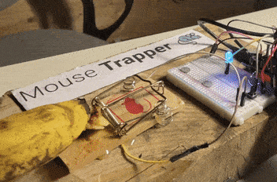

If you live in a 100-year old house as I do, chances are big you have some mice walking around in the walls. To beat them once and for all, I am going to make an internet-connected mouse trap.

For 100 years, the mice have reigned in this house, but now it's time for revenge.

## The old, traditional mouse trap

The traditional mouse trap works like this: You arm the trap, put some cheese on it, and wait. When the mouse comes for the cheese, the trap snaps a metal thing right over the mouse, leading to instant death.

The traditional mouse trap is boring. It doesn't even have software updates.

Let's build a new version suitable for the 21st century.

## Internet-connected mouse trap

The mouse trap will be connected to a small computer, and will send a notification to your phone when the trap catches something.

To make the mouse trap smart, we connect it to an ESP32 microcontroller. This is a small and affordable internet-connected computer. It reads real-time sensor data and can send messages on the internet.

## Transforming the mouse trap into a sensor

We need to be able to read the state of the mouse trap. Either it's on and armed, or it has snapped with a mouse inside. To make this possible, we turn the mouse trap into a button.

We add some wires to two springs:

And attach them to the trap:

In the background, you can see that the LED lights up when the metal from the mouse trap touches the springs. Hurray!

## Setting up the mouse trap to send notifications

I will leave out the technical details and source code, but if you are interested you can find it all in this [Gist](https://gist.github.com/larskarbo/cb198a3465246d7c9d7f6cee2004ab9a).

There are multiple ways to send notifications to a phone. One of the quickest is to use an existing app. We choose to send messages through the messaging app Telegram.

When running the code, we see it instantly on our iPhone:

## Bringing it all together

To make this invention last as long as its predecessor, we'll attach it to a big block of wood.

Here are all the parts:

Using hot glue and screws we take it all together, and add a logo. Doesn't it look beautiful?

## The mouse trap in action

Time to test our creation. Didn't find any mouse, so I'm using a banana instead.

It takes around 10 seconds before the notification shows up on the phone.

`video: https://youtu.be/8B5CsR2bGn0`

And a gif version of the action.

This invention shows that it's possible to hack together impressing things in a short time. The world of IoT devices like the [ESP32](https://www.espressif.com/en/products/modules/esp-wroom-32/overview) and services like [Telegram](https://telegram.org/) make this possible.

It might not be the most useful thing in the world, but it's fun!

Do you have a dumb thing in your house you would like to make smart?