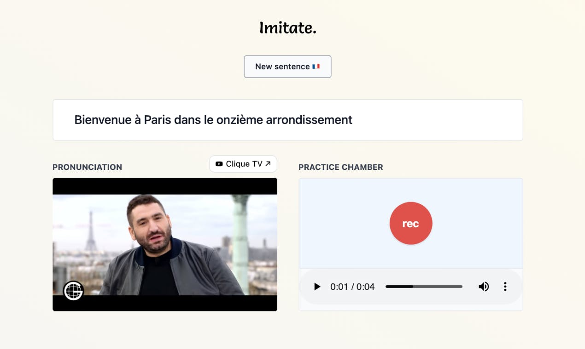
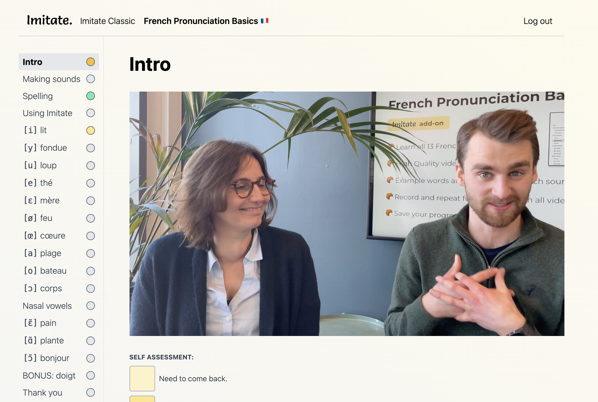

This is the most successful project I have done so far.

Imitate is a web-app for practicing French pronunciation with the use of random YouTube segments.

## TLDR

- _1 week:_ building prototype.
- _1 week:_ marketing.
- Got shoutout to **70K subscribers** on French Together.
- Collected **1500 emails**.
- To capitalize on the situation I spent 2 weeks and created a paid course.
- I pre-sold 50 copies of the course for 12$ each. That's 600$. 💰💰
- 😩 I barely finished the course, and haven't gotten more time to work more on the project.

Link: [goimitate.com](http://goimitate.com)

ProductHunt launch (142 upvotes): [https://www.producthunt.com/posts/imitate](https://www.producthunt.com/posts/imitate)

## I got 70K people to hear about my project

I decided to post updates on Twitter for my 1 week marketing sprint. Build in public. Create a huge following before launch. All of that.

I made waitlist subscribers my primary KPI, committed to post updates every day on twitter:

https://twitter.com/larskarbo/status/1351242667993264129

After a few days this ritual seemed a bit worthless. **I got only got a few subscribers every day.**

But then something awesome happened.

A guy called Benjamin reached out to me. He had seen some of my tweets. Turns out he is the man behind [French Together](https://frenchtogether.com) - a blog aimed and newsletter aimed at French learners. He is a part of the same [community](https://bloggingfordevs.com/) as me.

His newsletter had over 70K subscribers, and he wanted to give Imitate a shoutout.

This was huge!

Benjamin posted about Imitate on on a monday, and I immediately got a surge of new users on the site.

https://twitter.com/larskarbo/status/1354394800435437568

After launching I ended up with 1500 email subscribers, got more than 200 Google Form feedback submissions, and 150 email feedback replies.

## I earned 600$ as a French teacher

I felt the need to capitalize on the situation and momentum I had.

1500 subscribers on the email list.

I decided I would make a paid add-on to Imitate. A paid french pronunciation course. It's smart to sell before you make, so I put out a pre-order page and sent it out to all email subscribers. After two emails I had over 40 sales. Awesome.

I felt great, and motivation surged.

I hired a French native speaker to do some recordings with me.

Then I built the technical infrastructure.

And did video editing.

User accounts.

Payment integration.

Wow, this took longer time than expected.

I crunched through it. I didn't have much time. I was already way past schedule. I worked around the clock the last couple of days.

When I had something that worked (ish), I sent it out to the people who had pre-ordered.

I hit my deadline, but I was exhausted. I did not have time or energy to promote the release or get more sales. I did not have time to properly support the users. I was already three weeks into february. I still had another launch I had to do in February.

12 startups in 12 months is brutal, I had excactly 5 days left of February, and I needed to make a new product.

## I feel guilty about abandoning my users

The 12 startups in 12 months challenge forces you to move on to your next project. This can mean leavning unrealized potential and momentum, or letting fires burn.

After shipping the last Imitate update, I haven't even checked and responded to the feedback forms.

I feel guilty, but it's also an important learning experience.

Be able to say: "This is good enough", "This was the best I could do". And then move on.

I can always go and do another iteration when I have time.

## Conclusion

Imitate was an exciting project, and is the most profitable I have had so far. Mostly because of my lucky shoutout on a big newsletter, but also my ability to capitalize on a situation.

I knocked down my third launch, and am super happy to still be on schedule for the system.

Be sure to [subscribe to my newsletter](/newsletter) to be notified of new launches.