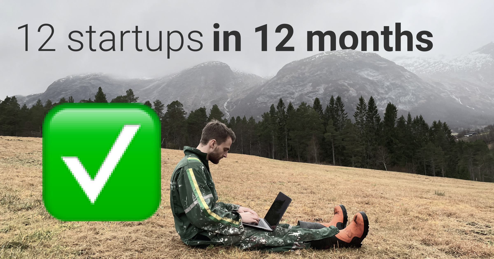
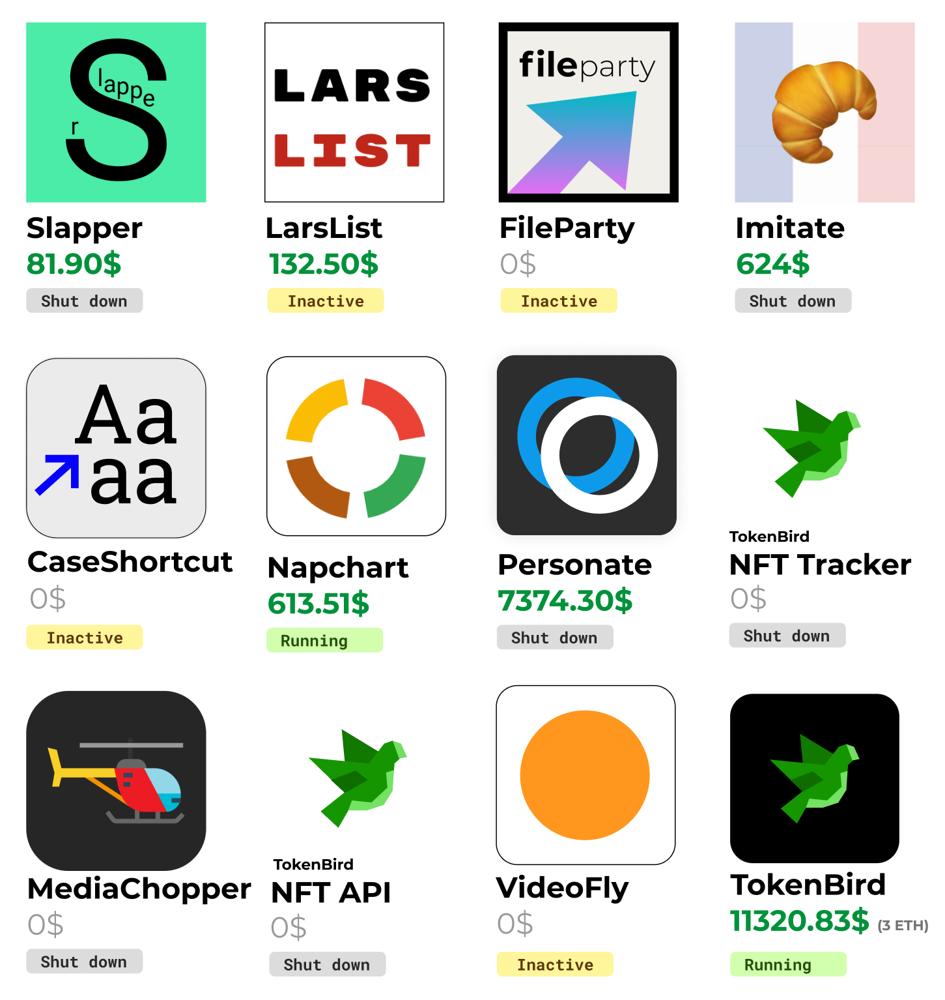
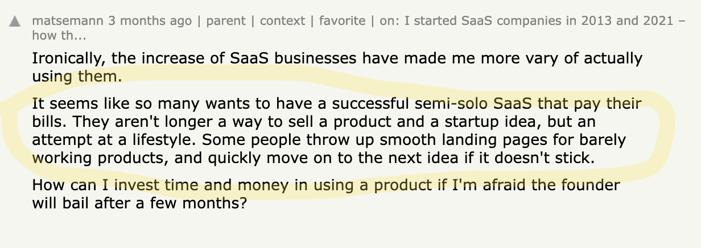
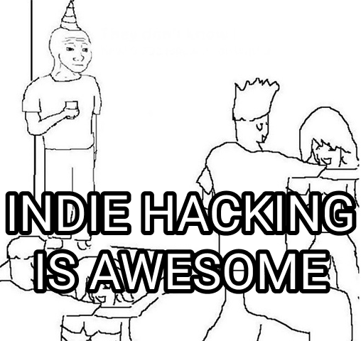
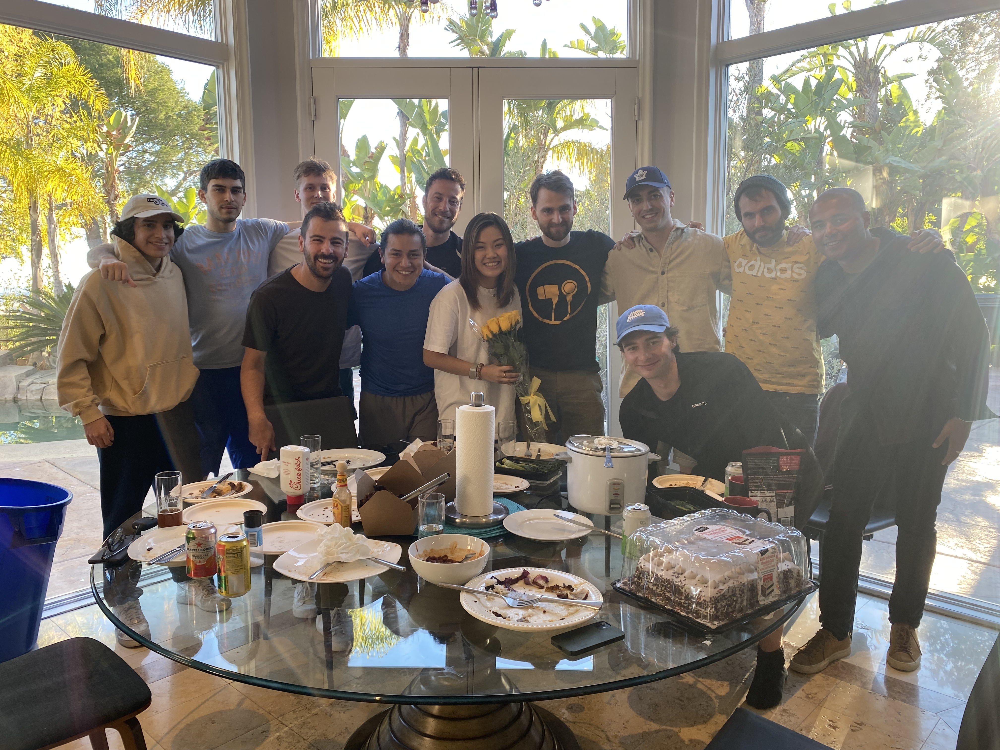
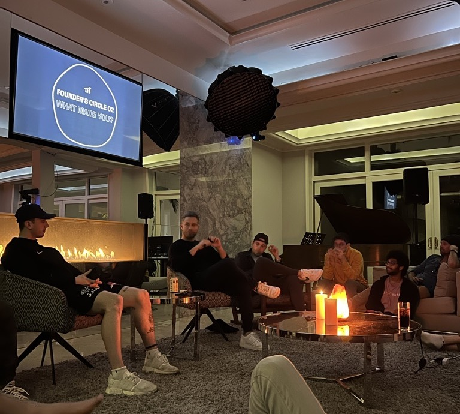

A year ago I started [12 startups in 12 months](https://larskarbo.no/12-startups-12-months/), where I set out to build many profitable small businesses for 12 months.

The motivation behind it was to try as many ideas as possible and build the necessary skills for succeeding at creative passive income projects.

It seems like most people who have started similar projects stop after two or three. I am happy I finished them all.

## How the Projects Went

Most of the projects were scrathing-my-own-itch problems that I could solve with a website or an app.

- [**Slapper**](https://slapper.io). Service to loop, and collect segments from Spotify and Youtube. Got 2 paying subscribers, earned 81.90$ in total. Shut it down.
- [**LarsList**](https://larslist.org). List of people named Lars. Costs 5$ to add yourself. Earned 132.50$. The most fun project.
- [**FileParty**](https://fileparty.co). (0$). This gets 40-50 daily visitors, but barely works. No monetization. I feel [watchparty.me](http://watchparty.me/) is better. Will probably shut down.
- [**Imitate**](https://goimitate.com). French Pronunciation method I made. Got shoutout on a newsletter. Upsold 25 for premium course access. Earned 624$. Stale ever since. I broke up with my French girlfriend and is therefore not motivated for French anymore. Shut down.
- [**Case Shortcut**](https://caseshortcut.com). Mac app for a global shortcut to change text case. Cost 5$. Nobody bought.
- [**Napchart**](https://napchart.com). Service I already made 5 years ago, 150 daily visitors. Monetized it by adding premium. Earned 613.51$ so far. Love this project no matter money. Will keep running it.
- [**Personate**](https://personate.ai). AI video generation. Made together with larsvagnes. Got a 7000$ B2B pilot client. Had traction but lost it. At the end of the day the whole product (vision) felt spammy. Shut it down.
- ***TokenBird*** (CoinMarketCap for NFTs). NFT project tracker. Made together with two friends. Only lasted one day before I knew I would shut it down.
- [**MediaChopper**](https://mediachopper.io). App to solve an extremely rare edge case in Davinci Resolve. No one ever used it.
- ***TokenBird*** (NFT API). Made to solve my own need when making NFT websites ([1](https://rudeboys.io), [2](https://holoworld.io)). Already had myself as a customer.
- [**Videofly**](https://videofly.io). Video transformation on the fly. Currently only used by me on a bunch of my projects. Almost got some big NFT sites to use it, but almost doesn’t cut it.
- [**TokenBird**](https://tokenbird.io) (NFT Marketplace). Third TokenBird pivot. Decentralized NFT marketplace. Got 3 ETH presale for access to the platform. Still working on this. It has potential.

I spent 2-6 weeks on most of the projects, and aimlessly tried to maintain and improve them for some more months before getting overwhelmed and shutting them down.

## Takeaways on Complexity

Somewhere in between number 6 or 7 — when I still tried to maintain them all — I realized something about simplicity. When you have 7 projects you need to maintain and update regularily, you start to understand that things need to be simple to work.

Even if you can build things quickly *(example: building a authentication system)*, you will end up having all that code to maintain months down the road.

## Takeaways on Life Design

You can't really talk about indie hacking without talking about life design.

This comment on HN resonated with me and left me a bit discouraged:

I guess this comment made me feel less unique. In dark times I start to question if the things I make even matter. It can be hard to feel like you build meaningful stuff when you only have a few weeks.

<!-- ### Meaning of life rabbit hole

I went through the philosophical and existential phase asking myself questions like "what's the meaning of it all", "what am I chasing".

It might be: get rich -> have a lot of time -> do whatever I want.

Work today to get some future satisfaction and reward.

But why not just work on doing the things you like today? Be really good at todays instead of futures?

These thoughts have altered my philosophy about life a little, but I'm not trying to decode the meaning of life here, I'll just use it to decide what to do next. -->

## Takeaways on Loneliness

I haven't lost the appeal of building things, but a lot of the indie hacking appeal has left me.

I would rather celebrate a victory together with a group of friends or co-workers, than sitting alone with my stripe revenue and MRR numbers.

Indie hacking is intristically lonely, other things are intristically not-lonely.

## Meaning Comes with Community

The last month of 2021 I had the pleasure of living with 20 other founders in Launch House in LA.

This experience made me realize how important community is. Having deep connections to people around you makes life so much more fun and meaningful.

Launch House is a new take on traditional business accellerators and universities. In the new modern world, you can get all information online. The important thing to focus on is relationships.

## Next Steps

I’m still thinking of what to do next year, but I’ll probably continue working in the Web3 space. Maybe I’ll go all in on TokenBird, or I’ll join another startup. I’ll focus on finding good people to work with and seek to be part of good communities.

This year has been a great experience. I am happy and proud of myself of finishing it through.

Thanks to everyone who supported me on the way. Especially [Monica Lent](https://twitter.com/monicalent), [12x group](https://12xstartup.com) and everyone at [Launch House](https://launchhouse.co).