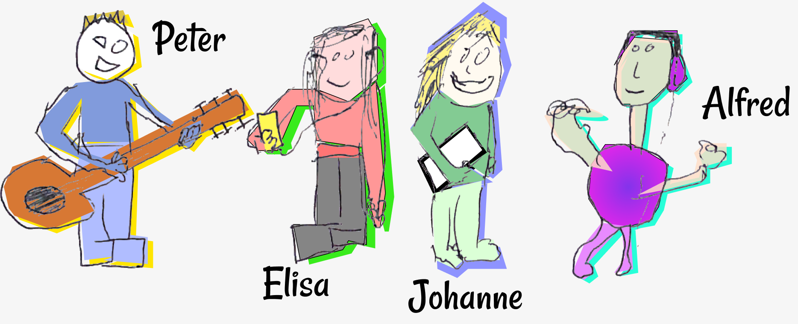
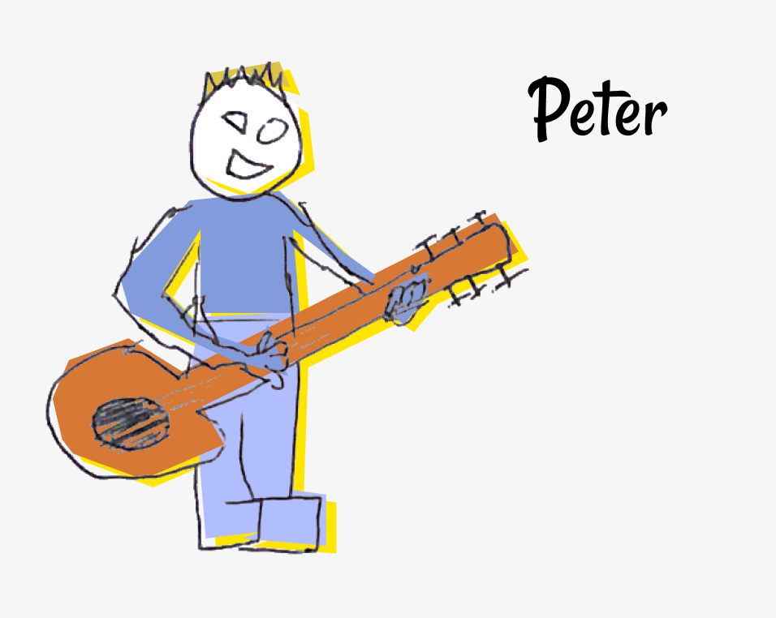
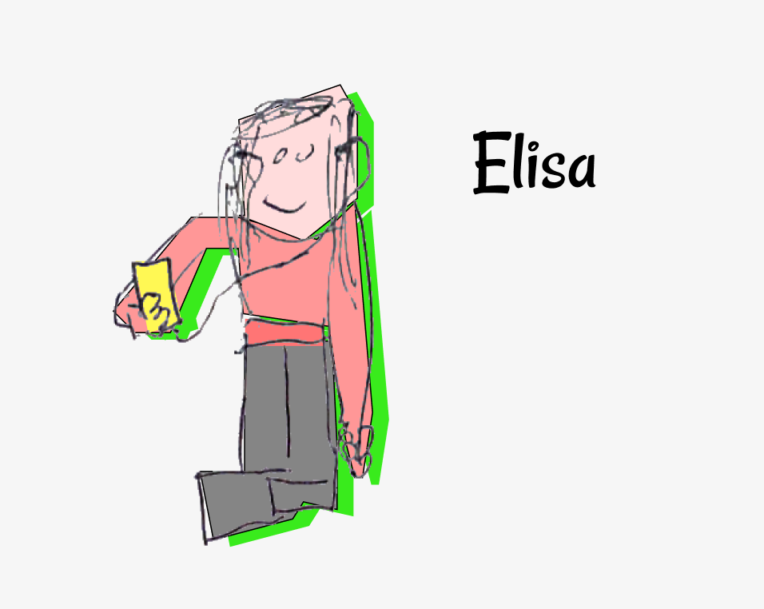
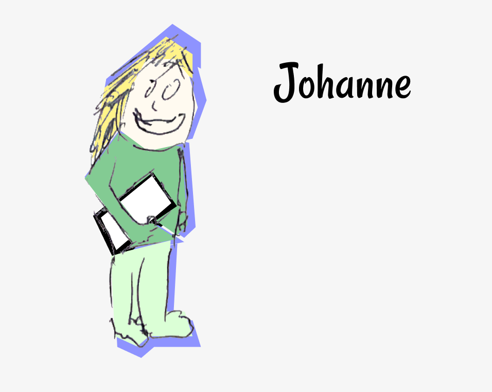
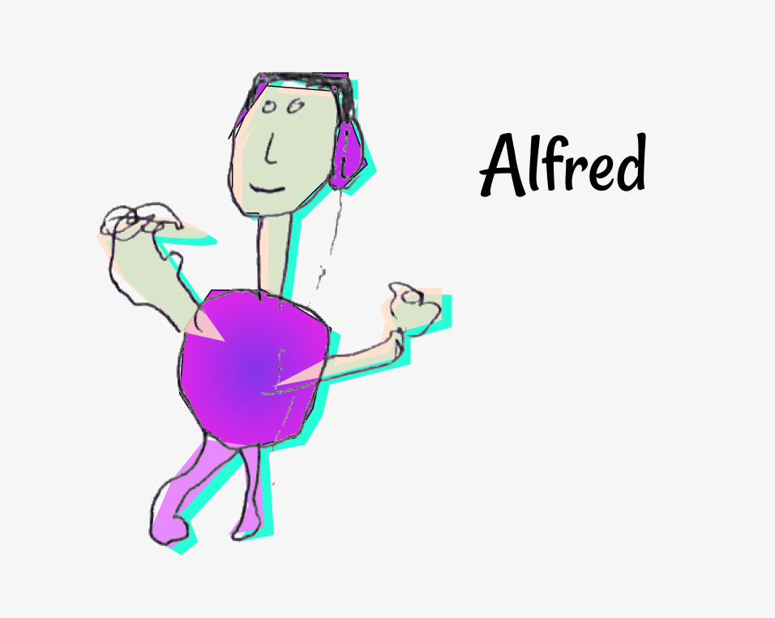
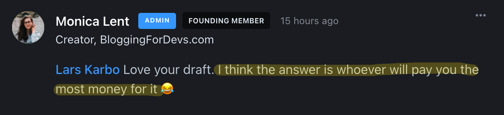

*Startup influencers often talk about how important it is to find your user segment.* Who are solving a problem for? [Figure out your niche](https://thebootstrappedfounder.com/finding-a-market-to-build-a-saas/), they say. Find your customer segment, they say.

I did not do that, and now I am stuck with the consequences.

The consequences:

I mean, look at them. This is what happens when I don't listen to the startup gurus.

I now have **4 different user segments with 4 different needs**. Which one should I focus on? I call them Peter, Elisa, Johanne and Alfred. They all want to use my app for different things. And it makes me crazy.

Let's break it down.

## The app I am talking about

The app I am talking about is [Slapper](https://slapper.io) - the first startup of my [12 startups in 12 months](https://larskarbo.no/12-startups-12-months/) challenge - but it's probably a relevant problem for all kinds of apps and products.

You might also end up with your own Peters, Elisas, Johannes and Alfreds.

## Peter: The Instrumentalist

**Peter uses Slapper to loop specific segments of a song when practicing.** He values speed, and doesn't care about sharing collections with his friends.

## Elisa: The Inspiration Gatherer

**Elisa uses Slapper for memorizing and organizing songs.** She also likes to share the collection with her friends or revisit it later. Sometimes she uses it professionally in music or art projects, and would like the UI to look a bit more beautiful.

## Johanne: The Music Teacher

**Johanne uses Slapper for giving homework to students.** She is a music teacher. To be able to share it with students is key, and she would want to have much more space for adding notes and text. Preferably some kind of Google Docs but with Slapper integrated.

## Alfred: The Playlist Person

**Alfred uses Slapper for having Youtube and Spotify in the same playlist.** He doesn't care much about the segments or notes. He's just too tired of having to switch between streaming services to play his favourite songs

## Who to choose?

**Am I left trying to make one piece of software fit for 4 different people?**

Or should I choose the most relevant usecase and double down on it?

Monica told me to choose the ones that pay the most for it, but right now **I have exactly 0 premium plan sales**, so that's kind of useless.

## Conclusion

I will trust my intuition and see which way the product goes. Hopefully I will find a way to make at least one of Peter, Elisa, Johanne and Alfred happy.

If you have suggestions or advice for Slapper or my [12 startups in 12 months](https://larskarbo.no/12-startups-12-months/) project, feel free to ping me on [Twitter](https://twitter.com/larskarbo).

And don't forget to follow my newsletter for updates.