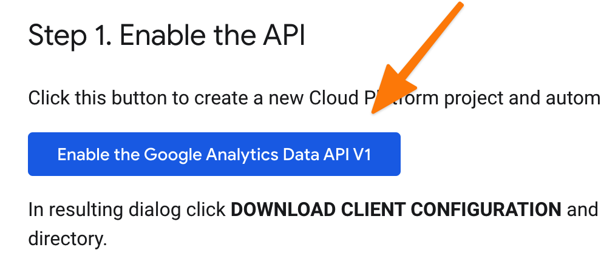
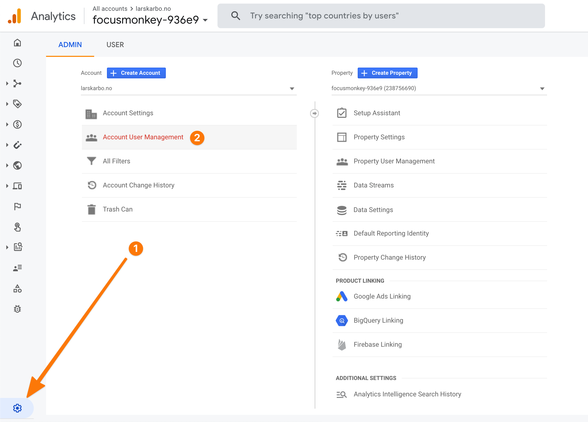
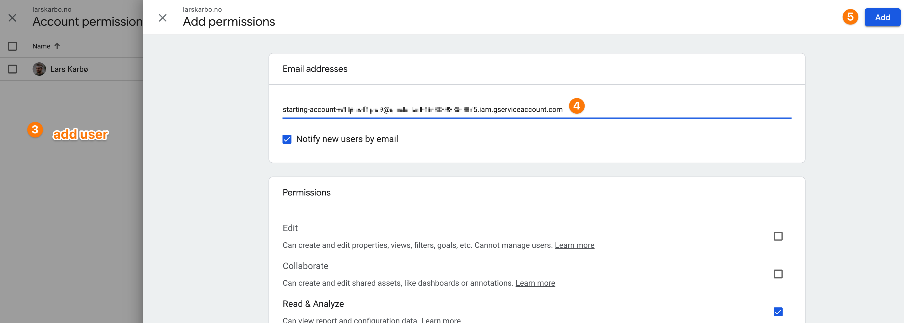

Google Analytics just released its new version Google Analytics 4. GA4 replaces Universal Analytics.

```js
"UA-18988-2" // old id (universal analytics)
"G-0JK8P4TLGP" // new id (ga4)
```

## Introduction

What are the opportunities Google Analytics 4 offer?

In this post we will explore how to fetch data from the API and use it in different ways.


## Initializing the API

We are going to use Node.js.

Before you start, you will need:

* A **GA4 property**. Make sure your property in Google Analytics is GA4 and not the old Universal Analytics.


* **A `key.json` for accessing the API**. Go to [this link](https://developers.google.com/analytics/trusted-testing/analytics-data) and initialize the key ↓
  


Also add the `client_email` from `key.json` to Google Analytics user management.





Then initialize a Node.js project.

```bash
yarn add @google-analytics/data dotenv
```

Add a `.env` file with a pointer to your `key.json` file:

```bash
GOOGLE_APPLICATION_CREDENTIALS="/Users/lars/dev/analytics-bot/key.json"
```

Add an `index.js` file:

```js
const propertyId = 250791696;
process.env.GOOGLE_APPLICATION_CREDENTIALS = "/Users/lars/dev/analytics-bot-2/key.json"

// Imports the Google Analytics Data API client library
const { AlphaAnalyticsDataClient } = require('@google-analytics/data');

// Creates a client
const client = new AlphaAnalyticsDataClient();
```

You are now ready to do a lot of cool stuff!


## Get unique visitors last week

```js
const { format, subDays, addDays } = require("date-fns");
// Runs a simple report.
async function lastWeekActiveUsers() {
  const from = subDays(new Date(), 7);
  const to = new Date();

  const [response] = await client.runReport({
    entity: {
      propertyId: propertyId,
    },
    dateRanges: [
      {
        startDate: format(from, "yyyy-MM-dd"),
        endDate: format(to, "yyyy-MM-dd"),
        name: "week",
      },
    ],
    dimensions: [
      {
        name: "nthDay",
      },
    ],
    metrics: [
      {
        name: "activeUsers",
      },
    ],
  });

  const data = response.rows
    .map((row) => ([
      parseInt(row.dimensionValues[0].value),
      parseInt(row.metricValues[0].value),
    ]))
    .sort(([ax],[bx]) => ax - bx)
    .map(([day, value]) => ([
      format(addDays(from, day), "yyyy-MM-dd"),
      value
    ]))

  console.log("Last week:");
  console.log(data)
}

lastWeekActiveUsers();
```

Output:

```bash
Last week
[
  [ '2020-10-24', 154 ],
  [ '2020-10-25', 130 ],
  [ '2020-10-26', 144 ],
  [ '2020-10-27', 330 ],
  [ '2020-10-28', 265 ],
  [ '2020-10-29', 103 ],
  [ '2020-10-30', 340 ],
  [ '2020-10-31', 59 ]
]
```

## Conclusion

This API is still in is infacy. I will update this article with more examples as we go!

Let me know if you have any troubles👌👌👌