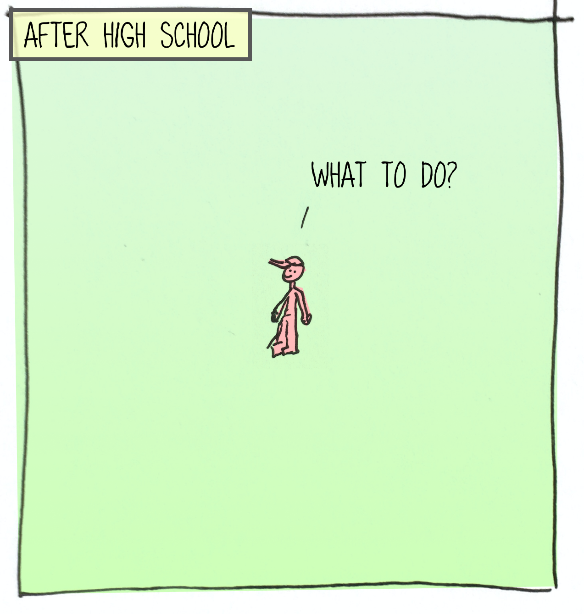
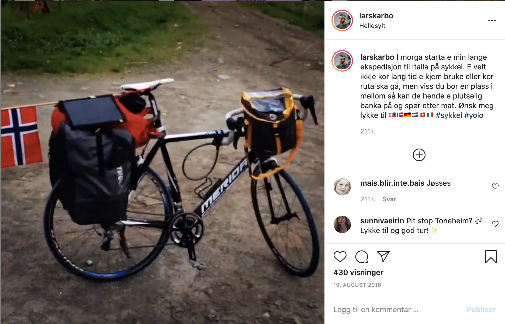
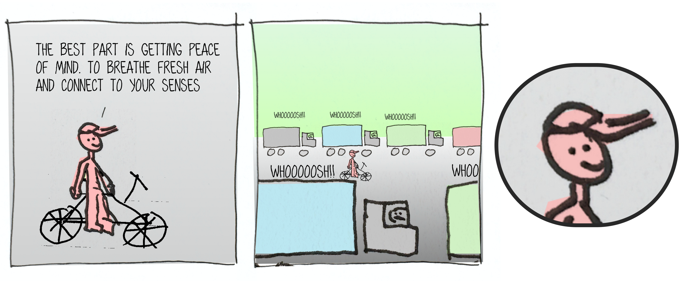

Some years ago, after high school finished, I tried to figure out what to do next.

Most people were going to university or starting ordinary, boring jobs.

I had a urge inside me to do something else. In fact do the opposite of what everyone else did. I wanted away.

I wanted to do something crazy.

One evening I suddenly got this idea for what to do. I wanted to 🚴 bike to from Norway to Italy.

> My plan was to take my bike, start biking, and not stop until I was in Italy.

In the beginning I did not have a clear target for where to bike. I told people I was going to bike *somewhere*. Somewhere in Europe. Or Africa maybe. But people didn't like the vague answers. I eventually settled on Italy. Having a clear goal is helpful both for you and the people that tries to understand you.

.png)

The journey lasted 3 months, and I learnt 3 things on the way:

* Learning #1: Social connection is a human need
* Learning #2: You won't have free time
* Learning #3: There are better places to bike

## Learning #1: Social connection is a human need

Before this trip I was surrounded by people all the time. I thought I was the kind of person who liked best to be alone. I thrived when I could get time for myself, so I thought it was the best idea to go on this solo trip.

After a couple of days in Denmark, without talking to anyone, I realized that this wouldn't work.

No matter how you think, without social connection your brain dies. It is a need, just like food, water and sleep.

After this realization I started a conscious effort to make social connections. I began using couchsurfing, reached out to people on the way and positioned myself in places to meet people. I slowly learnt how to keep the social part of my brain happy, and find friends in unlikely places.

This is a skill that I still find valuable today.

## Learning #2: You won't have free time

I daydreamed about everything I could get done while biking through europe:

- Build and interactive blog to show where I was and how much money I had left
- Build side projects that could turn into passive income streams
- Learn a language (maybe italian?)

I quickly realized that this was very over-ambitious. I spent most of my time on primary needs: **biking**, **finding food**, **finding a place to sleep**.

.png)

As opposed to many other forms of travel, when biking you spend most of your time *between cities*. It is not like you can make a base in a city for a week and then move on. You need to constantly move on. That makes it hard to find time, energy and places to get work done.

## Learning #3: There are better places to bike

It's raining. You don't know where you are. You are biking on the side of a car road. Cars and trucks are schwooshing past.

At this moment I realized that travelling for months along cars and noise isn't ideal.

I am used to hiking in the Norwegian nature. Days with silence, fresh air, beautiful scenery. You get time to think and relax.

Sometimes on this bike trip I asked myself: "why?". Why bike along the road with cars when I could bike on beautiful mountain paths or hike in wild nature?

Switzerland and Norway was the best. They had nice paths and roads for biking, and the exciting landscape makes it fun to bike. Completely flat landscapes are hard, because they don't give you any dynamics.

## This is not my last adventure

My bike trip was a prototype for future endeavours.

Whether it's business, travel, programming or building. I am going to adventure into new spaces.

Follow me at Twitter [@larskarbo](https://twitter.com/larskarbo) to see how it goes.