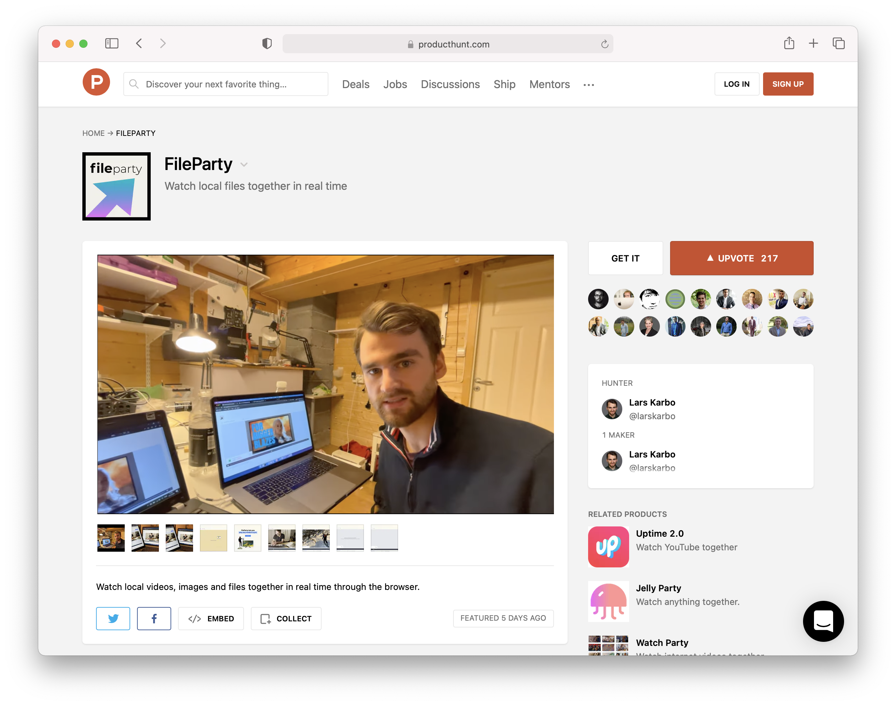
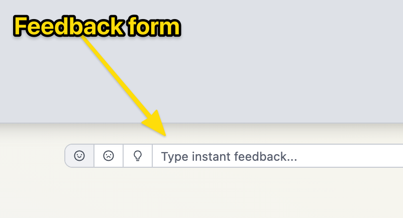
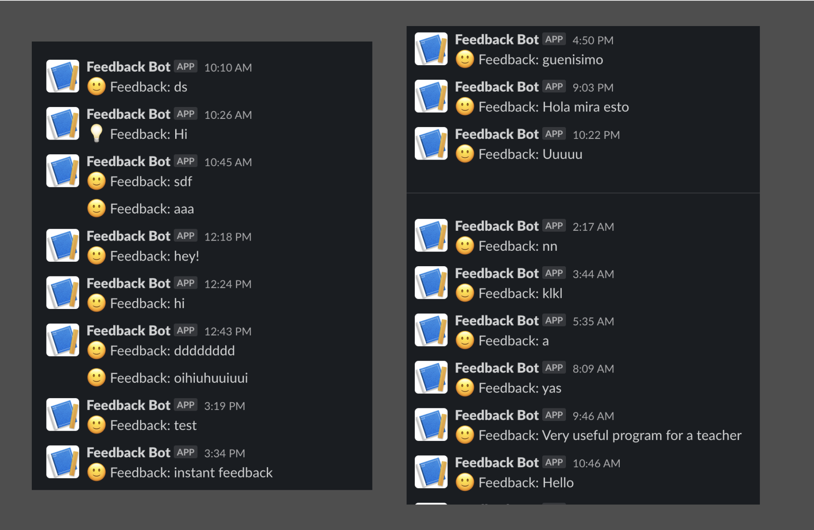

I had some insecurities about building FileParty. This is the story of how I found the idea, build it and launched it succesfully.

**TLDR;** [FileParty](https://fileparty.co/) is a real time file sharing service I hacked together and launched on Product Hunt. It got over 200 upvotes, but no revenue.

## How FileParty was born

I had to do a new project in December. It's part of my [12 startups in 12 months](/12-startups-12-months) project where I launch a new startup every month.

I never thought finding an idea would be a problem, because I always have too many of them. This is the reason I quit my job and became a indie hacker in the first place. But now I was actually not sure what to make. It needed to be something good!

After stressing about finding a good idea for some days, I remembered something I have heard. Having your schedule fully booked can be a disadvantage. It gives you a tunnel vision. Having some unstructured time can lead to discovering opportunities and serendipitous thoughts.

So I relaxed, took a week where I walked around, read, drank some coffee. Tried to talk to people. Just waiting for a good idea.

Then I read something about [WebRTC](https://developer.mozilla.org/en-US/docs/Web/API/WebRTC_API). The web API that makes it possible to do video calls in the browser. It makes it possible to send data directly from one computer to another. Just like torrent technology, like we had on The Pirate Bay. Could there be something for me here?

What about a **high-quality replacement for screensharing**? Where you share the actual video file instead of sharing a recording of your screen. I thought this could be valuable for presenters and teachers in the remote world. If you want to show a video or audio file over Zoom today, it sounds terrible.

Ok, so I had an idea for a product. Not the best, but time had passed so much -- *I was already 10 days into the month* -- so I felt the need to start.

This idea was definetely "cool tech" more than it was "something the market needed". I got interested in the tech, and made up a possible market need after. People say this approach is stupid, and you should identify user problems and then find a suitable solution. I get that. But I don't want to listen to it. I think there are multiple ways to make a successful project. Sometimes you might need to tinker with the technology, experiment with things, trust your intuition before you find something that works in the market. At least that's what I keep saying to myself.

> This idea was definetely "cool tech" more than it was "something the market needed".

In my situation, choosing something to build was better than doing nothing. At least I would increase my chance of serendipitous encounters and observations by doing it.

So I sat down to do what I like the most. Building.

## Building FileParty

The unique parts of FileParty is the p2p technology. Since the stable release in 2018, WebRTC has enabled this in the browser. This is why we can have video calls in browsers now without any plugins. When making a custom WebRTC app like I do, there is still a lot of work needed to make it work reliably. One common problem is peer discovert. You need to find the IP adresses of other computers visiting the same site.

I got the MVP up. Using Firebase, no authentication, trying to make it as simple as possible to test it out. I ended up using the amazing [WebTorrent](https://webtorrent.io/) library, which gives technology similar to BitTorrent just for the browser.

FileParty is full of bugs. There were bugs during development and there are bugs now. A lot of it comes from the fact that it is complex in nature, needing synchronization and relying on unstable external functions. 

But another part of it is that I need to write better code. Need to be better at taking a step back and refactoring. Drawing system arcitecture on a piece of paper. Speed is important in the dev world, but if you never focus on the craft of quality code, you will never be fast.

## Launching FileParty

As usual before launch, I get this feeling of disgust over the project. Can't stand it anymore. Just want it to be gone, over.

I have seen this in real life too. People get tired of a 5-year college degree right before it ends. People get tired of the 1-year military service right before it ends. I don't know the psychological reasons for this, but I think it's worth being aware of.

I always start to question myself before launching. "Is this thing even useful?". "It doesn't work anyways". Maybe it's my mind trying to protect me from the irrational dangers of putting my work out there.

Fuck that. I will launch things till I die.

On monday 28th December, I posted FileParty on Product Hunt, wrote the [twitter post](https://twitter.com/larskarbo/status/1343469561903984640), and sent a note to on my [personal newsletter](/newsletter). Then I took a step back and waited for the responses.

The takeaways after 48 hours was:

- ⬆️ Upvotes on ProductHunt: 192
- 👀 Visitors: 635
- 🔗 Boards created: 1073
- 💰 Revenue (donations): 0$
- ⏳ Time spent: 3 weeks

I got more upvotes than ever before ([#1](https://www.producthunt.com/posts/focusmonkey), [#2](https://www.producthunt.com/posts/slapper)), but didn't get that much engagement. Upvotes and likes aren't really important. I care about people that tested the product and sent me a message about it.

I am happy with the launch. The feedback I get over time, and my coming weeks reflections will decide is FileParty will go on to evolve or be killed off.

## Some thoughts about instant feedback

I added a input field on the site where people could instantly send feedback. I wanted to minimize the barriers for communication.

As an experiment, I hooked the box up to a Slack bot. This is how my inbox looked after launch day.

10-20 responses like "Hey!", "test" and "sdf". I mean, why do people do this? I don't get it.

Eventually, on the third day, I got some serious feedback ↓.

## An unexpected outcome

The head of product of an interesting new video communication platform contacted me.

He was interested in integrating FileParty with their service. This was exciting, and excactly the kind of opportunities I hoped the launch would give. I am going to meet with him next week, and will let you know how it progresses.

PS: I can't tell you the name of the platform yet. (But it's not Zoom.)

## Conclusion

I'm not sure about the future of FileParty, so I will let serendipity and the unknown powers of the universe work on it for a while.

* Maybe I will get a realization after a while?
* Maybe I will meet the right person that gets excited and leads FileParty the right way?
* Maybe it gets randomly picked up and goes viral?
 

I did not earn any money on FileParty. That is not good. I need to start creating things I can sell. **For my next launch I will earn 100$ on launch day.**

The launching muscle is getting stronger. Stay tuned for my next launch.