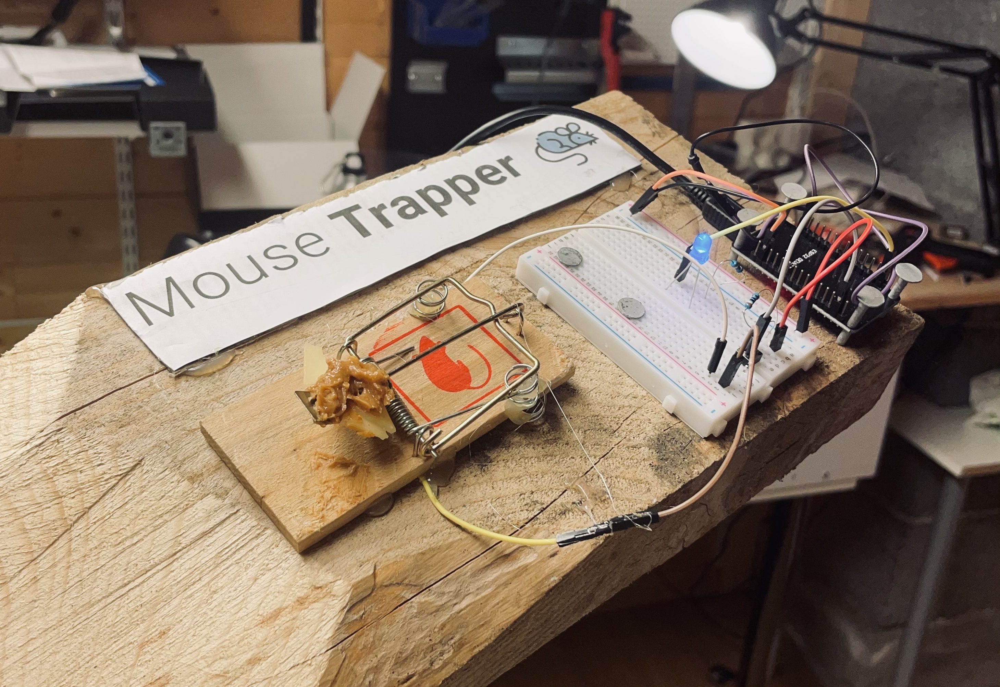

If you live in a 100 year old house like I do, chances are big you have some mice walking around in the walls. To beat them once and for all, I am going to make an internet connected mouse trap.

For 100 years, the mice have reigned in this house, but now it's time for revenge.

## The old, traditional mouse trap

You put some cheese on the trap, and wait. The mouse trap works by snapping a metal thing over the mouse when it comes to eat. This works pretty well, but you have to check manually to see if there is any mouse.

The traditional mouse trap is boring. It doesn't even have software updates. Looser.

Let's build a new version, suitable for the 21st century...

## Internet connected mouse trap

The mouse trap will be connected to a small computer, that will send a notification to your phone when there is some action in the trap.

We are using an ESP32 microcontroller. This is basicly a small and affordable internet connected computer. It can be connected to the wifi, and read realtime sensor data. It's the perfect choice for this project.

## Hack the mouse trap to become smart

We are going use the old mouse trap as the base for the new one. To do this, we are going to transform the mouse trap into a button.

We add two springs with some wires to the mouse trap:

Snap them onto the trap:

In the background, you can see that the LED lights up when the metal from the mouse trap touches the springs.

## Setting up the mouse trap to send notifications

I will leave out the technical details, but if you are interested you can check the arduino [soure code](https://gist.github.com/larskarbo/cb198a3465246d7c9d7f6cee2004ab9a).

To send notifications to the phone, we are going to use Telegram. We use Telegram because it makes it easy and free to create our own bots.

When running the code, this happens:

## Bringing it all together

To make this invention last as long as its predecessor, we'll attach it to a big block of wood.

Here are all the parts:

Using hot glue and screws we take it all together, and add a logo. Doesn't it look beautiful?

## The mouse trap in action

Time to test our creation. First, we arm the trap.

Then we put a pencil on the trap to simulate a mouse. And... Notification! Wihu!

This internet connected mouse trap will change my life.

Will you go and create your internet connected mouse trap?