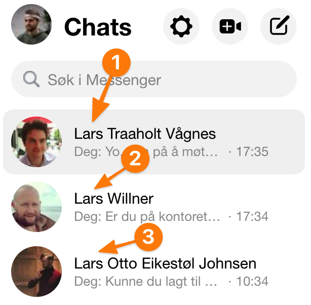
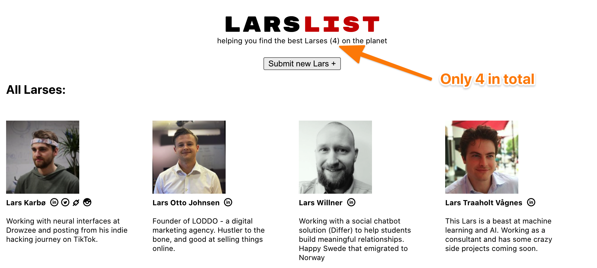
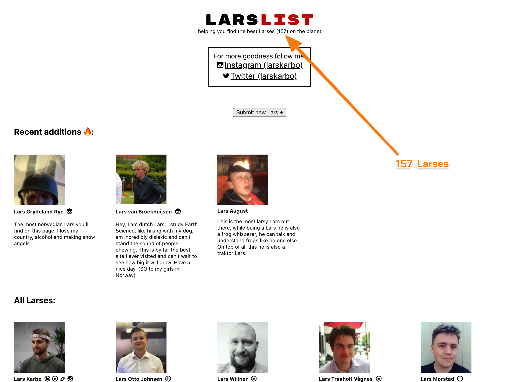
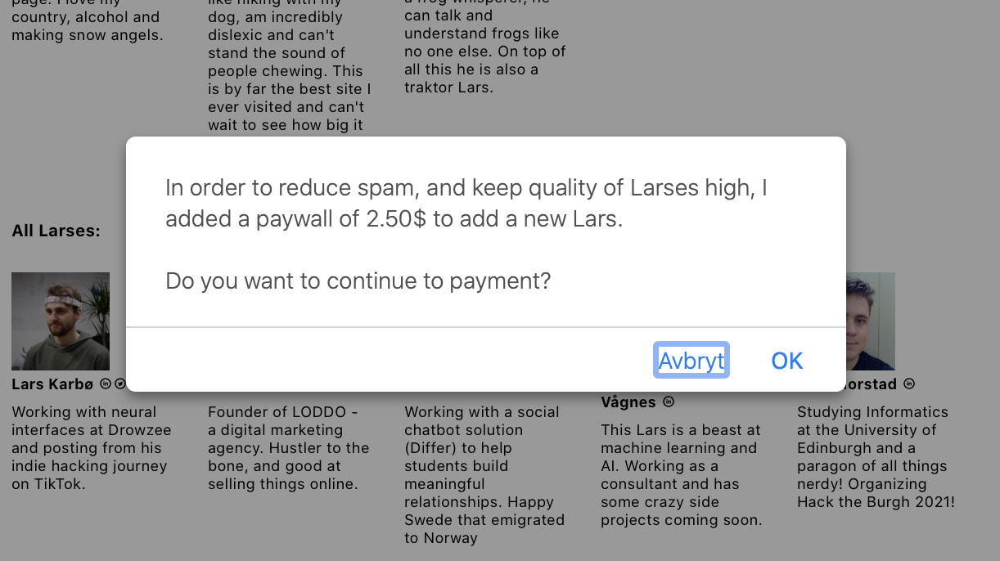
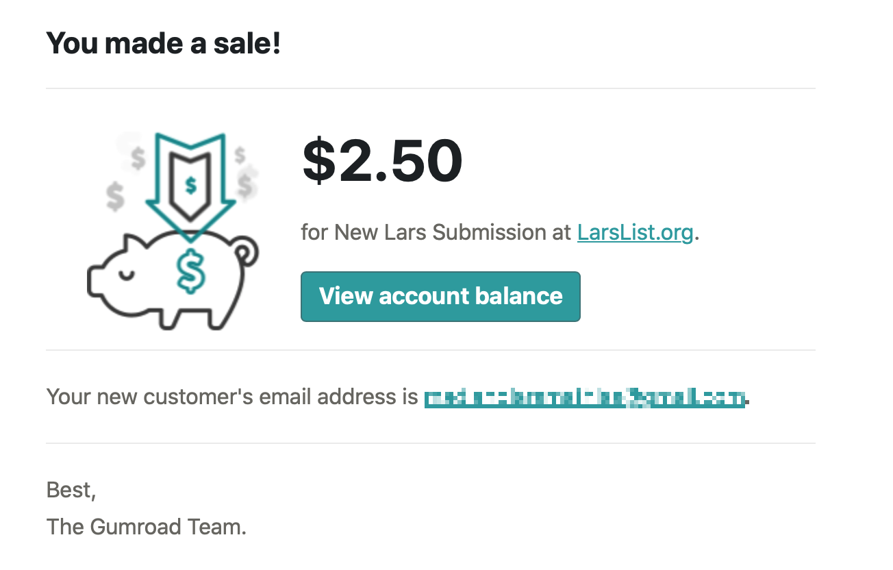
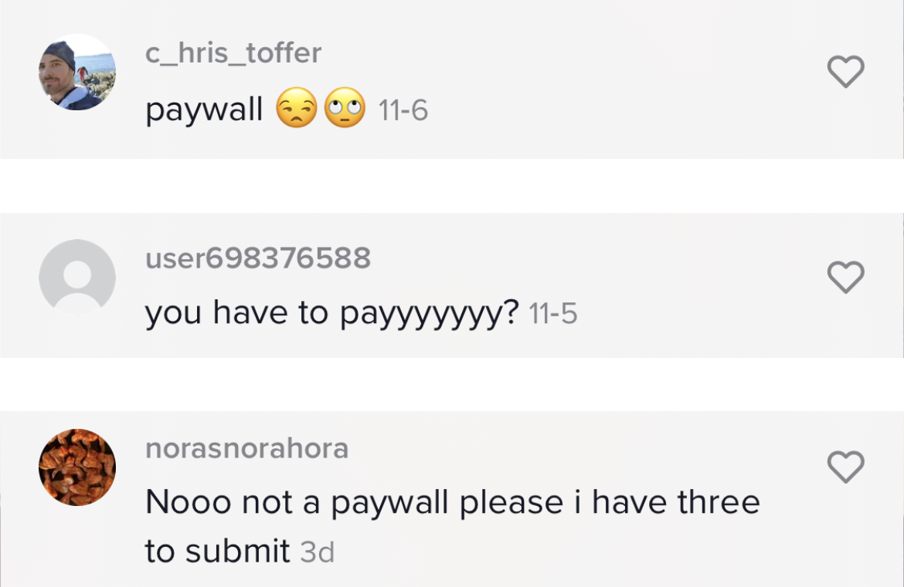
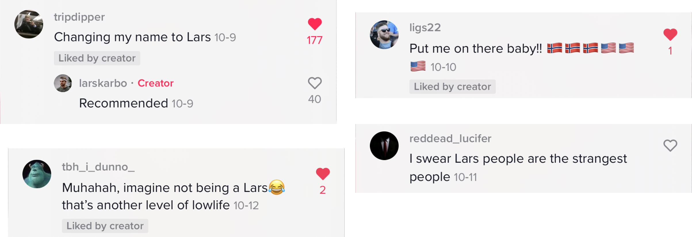
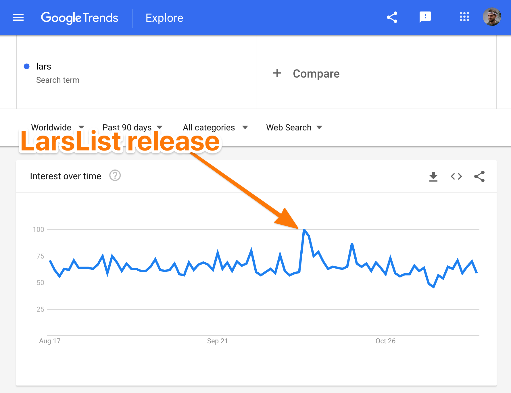

*I want to tell about a quick website I made (LarsList.org) that became viral on tiktok. This is how it happened.*

## The backstory.

It all started one day when I was watching my messenger window. Suddenly I saw that the three top chats were all Larses. Crazy!

So being the genius procastinator I am, an idea popped into my head.

**I should create a LarsList, a website where all Larses can be listed!**

I spent an evening or two, and hacked together LarsList.org. It was a simple site listing me and my three Larses. I also added a form where you could add yourself, if you are a Lars, but didn't really think anyone would do it.

## Put it on TikTok for fun (it blew up)

So, I went out and made a quick TikTok video. 15 seconds quickly explaining the site.

`video: https://www.youtube.com/watch?v=sKpY_QYM7kY`

Usually my TikToks would get around 500 views. A good one would get 1000 views.

This video had 5000 views in an hour. People were liking and sharing it like crazy.

**Seems like I tapped into something.**

People were submitting tons of Larses at the website. I got over 100 submissions the FIRST DAY. Submissions of Larses wanting to be on the LarsList. Crazy!

## Added pay a paywall (many paid)

It turned out that going through submissions and manually adding new Larses to the site was a hassle. Took a lot of time.

After some days -- when the hype had died down a bit -- I wanted to focus on other things and *not* be responsible for adding new Larses all the time. I had some alternatives:

* Automate the web site.
* Add a pay wall.

Adding a paywall seemed like the absolute most fun option. I need to practice my "ask for money"-skill anyways (it can be uncomfortable), so why not.

I mean, no one would *pay* to be on the LarsList anyways, right? Quick way of not having to do any work. And if it turned out that people actually bought a submission, I would be happy to spend some time on it. A real **WIN-WIN situation**. Either they stopped submitting and I didn't have to do work, OR they start paying and I become rich.

> ... no one would pay to be on the LarsList anyways, right? **Quick way of not having to do any work**.

So I added a simple gumroad link to the submit button. It now cost 2.5$ to be submitted to the LarsList.

And after some time, to my great surprise, I got this email:

Nice! Fun! Haha, it gave me a good laugh. Someone actually paid to be on my silly LarsList site!

> Someone actually paid to be on my silly LarsList site!

And over the next weeks, some other submissions rolled in. I have gotten almost 10 paid LarsList submissions now.

That's 25$ in total. Not huge. But really fun.

## Negative reactions to the paywall

It is uncomfortable for me to ask for money. That's why I am practicing it.

Especially uncomfortable when it is something as silly as Lars List. **I knew there would be some negative reactions on the paywall.**

Most of the negative feedback were from TikTok comments:

This is something we have to live with. I am proud of keeping the paywall, even when I have (at least) 3 haters.

## Reactions in the world

Ori Brafman writes about how **similarity** can influence how connected strangers feel with each other.

> "Having a similar name was certainly a significant factor that led them to connect."

From: *Click - the magic of instant connection*

The same way, it felt like many Larses liked the idea of this site. Perhaps by making Larses proud of their name?

### Google trends for Lars increased by 60%

Seems like I also influenced the popularity of "Lars" in general.

Google trends shows a 60% increase in search traffic for the word "Lars" when the video was released.

Will have a look at the birth statistics next year. Maybe we'll see a spike in Lars-babies from 2020?

> Maybe we'll see a spike in Lars-babies from 2020?

## The next step (what to do with a community of 150 Larses?)

I envy people that can turn some viral moment into their benefit. That's what I tried to do and **earned 25$**. Not too bad.

But now I'm wondering, should I do something more now? Or just leave this site floating in the void of the internet.

I mean, I have 150 emails. But not sure what to do with them.

<!-- ### Lars of the month

Yes, we started with ads on LarsList, BUT you need to fulfill these requirements:

* Only Larses can advertise
* It costs 15$ for a month -->

*Do you have any ideas? Let me know in the comments!*