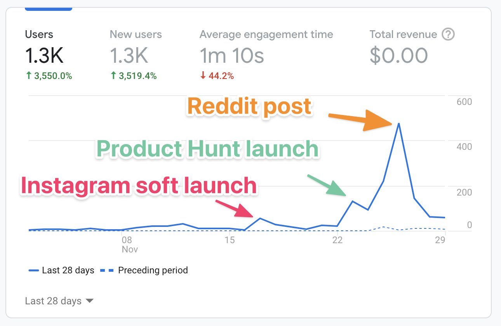
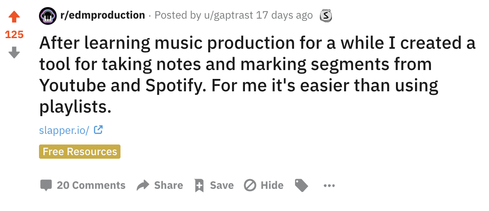

This is the first startup I launched in my [12 startups in 12 months](/12-startups-12-months/) project.

I did the first of my projects in November. It was very fun. The project is [Slapper](https://slapper.io).

In one month, I built and launched it. Here is my breakdown of it.

## Launches

I did some *soft launching* in Instagram and my personal networks first.

Then I launched on [ProductHunt](https://www.producthunt.com/posts/slapper). It didn't perform that well, but got a good amount of users.

The best launch I had, was the [post](https://www.reddit.com/r/edmproduction/comments/k12297/after_learning_music_production_for_a_while_i/) I made on reddit. I made the post in /r/edmproduction and people seemed to like the humble personal style of the post.

## Revenue

<s>I added a payment portal, but did not get any sales.</s>

EDIT: Just checked, I GOT ONE SALE!!

https://twitter.com/larskarbo/status/1338131532289077248

Wow, I really didn't optimize for getting sales. But now that I have one I feel a burst of energy. FEELS SO NICE!

## Did people like it?

I have gotten some positive feedback from people. I found 5-6 potential power users that were really happy with it.

But when it comes to user behavior I feel pretty blind.

I feel like I know too little. I have a Google Analytics script, so I see the number of users, but I don't really see or understand much else.

The best would probably be if I had a dedicated dashboard to see how many new users I have gotten, how many of those made *slaps*, and in general what people are doing on the site.

## Building a project on APIs.

APIs are great, and building things by using other services is a lot of fun, but it also adds some uncertainty to the project.

For the future of Slapper, I have questions like this:

- Can I really monetize the app when using the Spotify API?
- Will youtube suddenly disallow my domain for iframes?

Ads from Youtube don't show up in Slapper. Sounds like a bad deal for Google.

## Moving on

It is a weird feeling to stop working on a project right after you have gotten a lot of new users. I think Slapper would need 2-3 more months of work before it could be something sustainable and growing.

It is part of the learning process of this project. You just need to let it go.

For now, I am letting slapper float its own way. I am not shutting it down, because maybe it will suddenly mature and get picked up by some exciting institution or group of people.

Or maybe I will suddenly meet someone that gives me a valuable insight for Slapper?

Goodbye for now, Slapper.

PS: I have been working a lot on my December project, which I will be releasing very soon.

