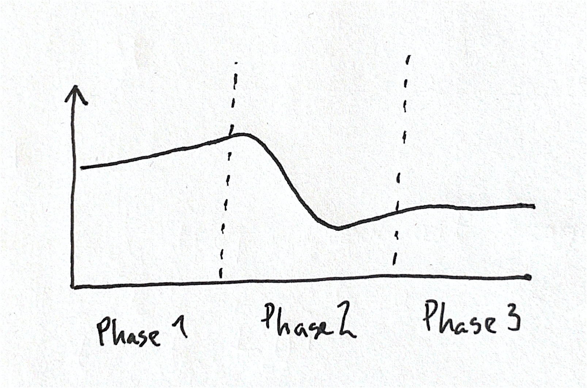
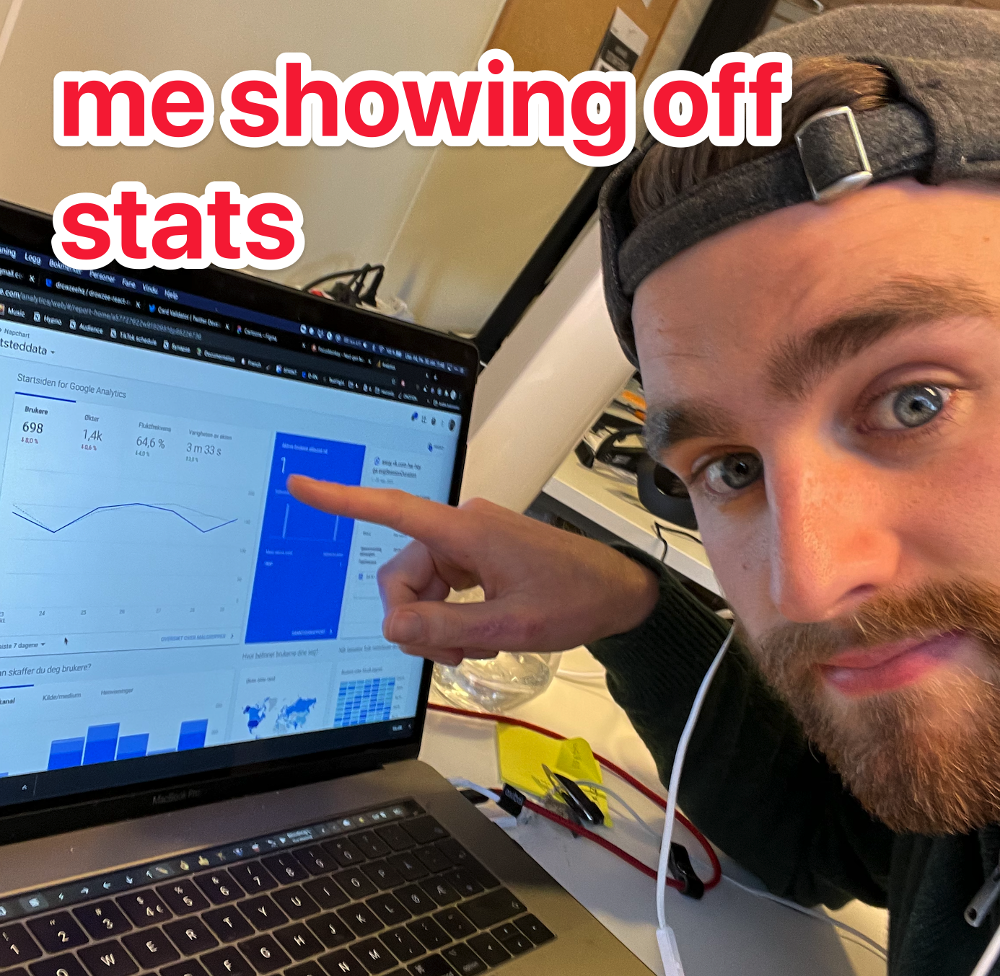

This model will make you more successful at creating useful stuff on the web.

It is simple and easy to understand.

<!-- memes further down -->

## The three Phases

I have _a lot_ of failed projects that never got out of phase one (at least 150), I have some things that I released, but never took it further. And I have a few successful projects.

> I have _a lot_ of failed projects that never got out of phase one

By recognizing these phases and thinking rationally about them we will become better at creating **successful projects**.

### Phase 1: Building

<!-- me building a random idea I got. (background the work i was doing before) -->

This is the phase where you start coding the project.

You have this amazing idea. Maybe you think you'll be able to finish it quickly.

You make a github repo and things start to take form.

If you release it, big or small, you go on to **phase two ↓**.

### Phase 2: Releasing

<!-- me posting to producthunt. (to my mum: can you please like my producthunt launch) -->

You'll stay in phase two as long as you are still releasing and improving.

Some marketing and outreach might be necessary in this phase.

When you start getting traction and people start to use your product, you move on to **phase 3 ↓**.

### Phase 3: Traction

<!-- me showing g-a or smth. -->

Congratulations! You made something that is usable and valuable for people!

From here you can leave it, continue to work on it or start monetizing it.

## Common pitfall #1: Never releasing

<!-- Project 153 -->
<!-- I am almost done with this project. Let's put it away and never look at it again -->
<!-- Finishing soon folder -->

This is the most common pitfall.

You start building something, never get to the point where you can share it.

Sometimes, it is ok. If your idea wasn't that good anyways.

> Think small, and minimum viable product, to quickly move on to phase 2

## Common pitfall #2: Lose motivation after first release

<!-- Well -->
<!-- zooming in on the floor at my ugly project -->
<!-- nobody want to use my project, think I have to make something else -->

I _love_ building and shipping new things. Sometimes I get extremely motivated in the beginnings.

The next step is harder. The step to take the creation and make it into something better. It requires iteration and hard work, and doesn't give you instant gratification.

The idea didn't _take off_, and you are unsure whether it's any point in continuing.

I think it is important to learn that it might take more work before you find traction.

> Your **motivation** is a bad indicator of whether you should work on something or not.

## A note about business.

You are probably thinking of something that is missing.

What about _validation_ before building anything? What about _monetizing_ and _scaling_?

This model is solely based on the _build_ aspect. It doesn't mean the business parts aren't important. Because they are.

> Business parts are important, but not included in this model

## Conclusion

Recognize the phases and the common pitfalls and you will have an easier time building useful stuff on the web.

Make sure to share this with anyone you think would like to hear it!

Which phase do your projects usually end up in? Let us know in the comments.
