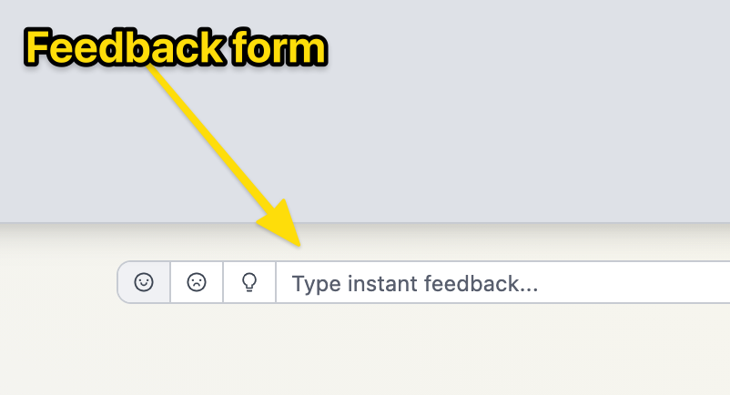
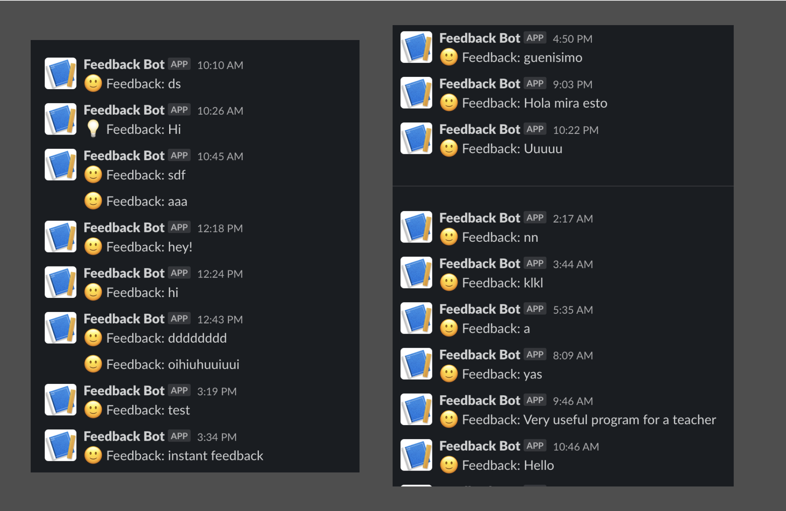

## Some thoughts about instant feedback

I added a input field on the site where people could instantly send feedback. I wanted to minimize the barriers for communication.

As an experiment, I hooked the box up to a Slack bot. This is how my inbox looked after launch day.

10-20 responses like "Hey!", "test" and "sdf". I mean, why do people do this? I don't get it.

Eventually, on the third day, I got some serious feedback ↓.