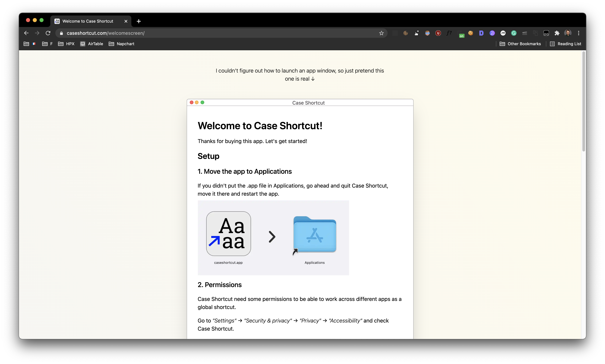
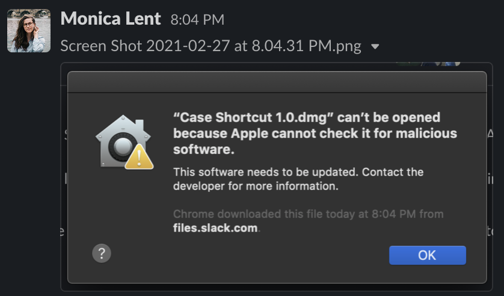

I had five days to build and launch this thing. I failed.

Check out the product here: [caseshortcut.com](https://caseshortcut.com/)

The app is called Case Shortcut, and lets you change case between UPPER, Title, lower, and all other cases.

Super simple. Super small.

## Learning Swift in 1 hour

I didn't want any cross-platform electron bloatware for this simple utility app. So I had to learn Swift.

So I went ahead and pieced together an MVP of Case Shortcut. Copy-pasting lots of things from Stack Overflow. I didn't know what I was doing.

One problem I had was that I couldn't figure out how to open a welcome screen for the app. Being pressed on time, I brought up my most creative hacker spirit and made the same window in a website instead.

When you open Case Shortcut it opens [this page](https://caseshortcut.com/welcomescreen/). Heheh, I feel evil.

I finished the MVP, made the fully functional landing page with Stripe integration. Everything was ready.

I was going to launch on Product Hunt  Sunday morning.

But then something happened...

## Failing

The app signing didn't work properly.

I was able to piece together a Swift app in a couple of days. But learning the Apple bureaucracy? Not a chance.

App signing, notarization, sandboxing. Things like that. Not a chance.

The only way people could use Case Shortcut was by adjusting their Mac security settings. Like pirates do.

I couldn't sell this. I postponed the launch.

I was so close.

But I guess this is how it is.

Maybe I will find some time later and launch it.