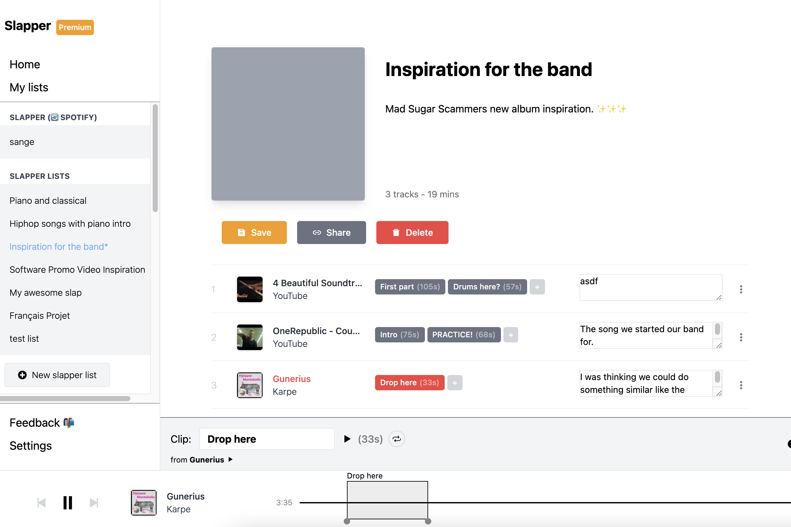

Slapper.io was the first of my [12 startup in 12 months](/12-startups-12-months) project. I planned to keep all of the projects alive, but I changed my mind. Slapper has to die.

Slapper was a complex product that tried to solve [multiple usecases](/4-customer-segments/). I never found the *one* thing that I could focus on and solve in a good way, so I ended up solving a lot of things poorly.

## Why not keep it alive?

The main reason for not keeping it alive and online is that it relies on too many 3rd party integrations. Slapper integrated with a (buggy) Spotify API and used iframes for YouTube. The YouTube integration was very unstable, and the Spotify integration was laggy and unpredictable.

I enjoy building things that can live on and still be useful in 5 or 10 years. Slapper is not that kind of product.

It also doesn't have a lot of SEO content, and almost doesn't bring in any traffic.

## Saying goodbye to 10$ MRR

During the initial months of Slapper I managed to get two paying premium members. It feels a bit weird and wrong to shut down something that is actually bringing in money, but I guess that's the kind of choices you have to make.

## Building the right kind of portfolio

I am building a portfolio of small bets. I want to build projects that are timeless -- that they will get better and stay relevant over time. So that I can come back and do little pieces of work, and they can bring me opportunities and revenue.

Slapper wasn't a good project for me, so I'm shutting it down now.

Thanks to all the people supporting me on the journey, and especially to the two persons that bought the premium subscription!